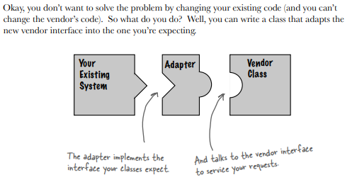
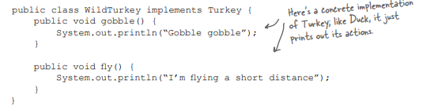
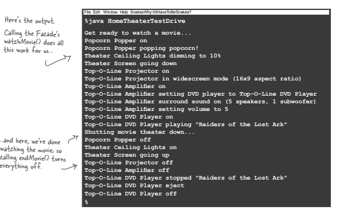

**Adapter & Facade Pattern**

Have you ever needed to use a US-made laptop in a European country? Then you’ve probably needed an AC power adapter…

**Object Oriented Adapters**

**Turkeys & Ducks**

**Duck interface**

**Here’s a subclass of Duck, the MallardDuck**

**Turkey Interface**

**Here’s a subclass of Turkey, the WildTurkey**

**Now, let’s say you’re short on Duck objects and you’d like to use some Turkey objects in their place. Obviously we can’t use the turkeys outright because they have a different interface.**

**Adapter to convert a Turkey to Duck (expected)****Test Drive**

**What’s actually happening?**

**Adapting a Duck into a Turkey**

**Q: How much "adapting" does an adapter need to do? It seems like if I need to implement a large target interface, I could have a LOT of work on my hands. **

**A: **You certainly could. The job of implementing an adapter really is proportional to the size of the interface you need to support as your target interface. Think about your options, however. You could rework all your client-side calls to the interface, which would result in a lot of investigative work and code changes. Or, you can cleanly provide one class that encapsulates all the changes in one class.

**Q: Does an adapter always wrap one and only one class? **

**A:** The Adapter Pattern’s role is to convert one interface into another. While most examples of the adapter pattern show an adapter wrapping one adaptee, but you may well have situations where an adapter holds two or more adaptees that are needed to implement the target interface. This relates to another pattern called the Facade Pattern; people often confuse the two. 

**Q: What if I have old and new parts of my system, the old parts expect the old vendor interface, but we’ve already written the new parts to use the new vendor interface? It is going to get confusing using an adapter here and the unwrapped interface there. Wouldn’t I be better off just writing my older code and forgetting the adapter? **

**A:** Not necessarily. One thing you can do is create a Two Way Adapter that supports both interfaces. To create a Two Way Adapter, just implement both interfaces involved, so the adapter can act as an old interface or a new interface.

** Adapter Pattern Defined**

This acts to decouple the client from the implemented interface, and if we expect the interface to change over time, the adapter encapsulates that change so that the client doesn’t have to be modified each time it needs to operate against a different interface. 

**Class Diagram**

**Object and class adapters **

This chapter has covered object adapters till now. 

**So what’s a class adapter and why haven’t we told you about it? **

Because you need multiple inheritance to implement it, which isn’t possible in Java. But, that doesn’t mean you might not encounter a need for class adapters down the road when using your favorite multiple inheritance language!

Look familiar? The only difference is that with class adapter we subclass the Target and the Adaptee, while with object adapter we use composition to pass requests to an Adaptee. 

**Comparing the two**

**Object Adapter: **

→ Uses object composition to wrap the adaptee with an altered interface. 

Advantage: Can use this adapter to adapt to any subclass of the adaptee. 

**Ex: Apart from WildTurkey we could pass AustralianTurkey**

**Class Adapter: **

→ This will have trouble with that because I am committed to one specific adaptee class.

---------------------------------------------------------------------------------------------------------------------------

**Class Adapter: **

→ Uses Inheritance

Advantage: Can override the behavior of adaptee if need be

**Object Adapter: **

Cannot override a method, but any behavior if added to adapter code works with the adaptee class and all its subclasses.

But if a subclass of adaptee adds some new behavior. Then we need to compose with the subclass to make that work. (this might be messy)

---------------------------------------------------------------------------------------------------------------------------

**Object Adapter: **

→ This pattern binds the client to an interface, not an implementation; we could use several adapters, each converting a different backend set of classes. Or, we could add new implementations after the fact, as long as they adhere to the Target interface.

**Ex: today we are adapting a Turkey into a Duck, tomorrow we could adapt any other animal into a duck**

---------------------------------------------------------------------------------------------------------------------------

**Object adapters and class adapters use two different means of adapting the adaptee (composition versus inheritance). How do these implementation differences affect the flexibility of the adapter?**

**Real world adapters 		**

**We are often faced with legacy code that exposes the Enumerator interface, yet we’d like for our new code to use only Iterators. It looks like we need to build an adapter**

First we’ll look at the two interfaces to figure out how the methods map from one to the other. In other words, we’ll figure out what to call on the adaptee when the client invokes a method on the target.

**Designing the Adapter**

An adapter that implements the Target interface and that is composed with an adaptee. 

The hasNext() and next() methods are going to be straightforward to map from target to adaptee: we just pass them right through. 

For now, here’s the class diagram:

**But what do you do about remove()? **

Well, we know Enumeration just doesn’t support remove. It’s a "read only" interface. There’s no way to implement a fully functioning remove() method on the adapter. The best we can do is throw a runtime exception.

This is a case where the adapter isn’t perfect; clients will have to watch out for potential exceptions, but as long as the client is careful and the adapter is well documented this is a perfectly reasonable solution. 

**Writing the EnumerationIterator adapter **

**While Java has gone in the direction of the Iterator, there is nevertheless a lot of legacy client code that depends on the Enumeration interface, so an Adapter that converts an Iterator to an Enumeration is also quite useful. **

**Write an Adapter that adapts an Iterator to an Enumeration. You can test your code by adapting an ArrayList. The ArrayList class supports the Iterator interface but doesn’t support Enumerations (well, not yet anyway).**

**Facade Pattern**

**Home Sweet Home Theater **

Check out all the components available: 

Home theatre does the following tasks:

1. Turn on the popcorn popper 

2. Start the popper popping 

3. Dim the lights 

4. Put the screen down 

5. Turn the projector on 

6. Set the projector input to DVD 

7. Put the projector on wide-screen mode 

8. Turn the sound amplifier on 

9. Set the amplifier to DVD input 

10. Set the amplifier to surround sound 

11. Set the amplifier volume to medium (5) 

12. Turn the DVD Player on 

13. Start the DVD Player playing 

Let’s check out those same tasks in terms of the classes and the method calls needed to perform them:

What’s more to do:

* When the movie is over, how do you turn everything off ? Wouldn’t you have to do all of this over again, in reverse? 

* Wouldn’t it be as complex to listen to a CD or the radio? 

* If you decide to upgrade your system, you’re probably going to have to learn a slightly different procedure.

So what to do? The complexity of using your home theater is becoming apparent!

**To use the Facade Pattern, we create a class that simplifies and unifies a set of more complex classes that belong to some subsystem.**

Don’t worry; if you need the power of the complex subsystem, it’s still there for you to use, but if all you need is a straightforward interface, the Facade is there for you. 

**Q: If the Facade encapsulates the subsystem classes, how does a client that needs lower-level functionality gain access to them? **

**A: **Facades don’t "encapsulate" the subsystem classes; they merely provide a simplified interface to their functionality. The subsystem classes still remain available for direct use by clients that need to use more specific interfaces. 

**Q: What is the benefit of the facade other than the fact that I now have a simpler interface? **

**A: **The Facade Pattern also allows you to decouple your client implementation from any one subsystem. Let’s say for instance that you get a big raise and decide to upgrade your home theater to all new components that have different interfaces. Well, if you coded your client to the facade rather than the subsystem, your client code doesn’t need to change, just the facade (and hopefully the manufacturer is supplying that!).

**Q: Does each subsystem have only one facade?**

**A:** Not necessarily. The pattern certainly allows for any number of facades to be created for a given subsystem.

**Q: Does the facade add any functionality or does it just pass through each request to the subsystem? **

**A:** A facade is free to add its own "smarts" in addition to making use of the subsystem. For instance, while our home theater facade doesn’t implement any new behavior, it is smart enough to know that the popcorn popper has to be turned on before it can pop (as well as the details of how to turn on and stage a movie showing).

**Constructing your home theater facade **

**Let’s implement the watchMovie() and endMovie() methods:**

**SHOWTIME: TIme to watch a movie**

**Facade Pattern defined **

**Implementing a facade requires that we compose the facade with its subsystem and use delegation to perform the work of the facade. **

**The Principle of Least Knowledge **

It means when you are designing a system, for any object, be careful of the number of classes it interacts with and also how it comes to interact with those classes. 

This principle prevents us from creating designs that have a large number of classes coupled together so that changes in one part of the system cascade to other parts. When you build a lot of dependencies between many classes, you are building a fragile system that will be costly to maintain and complex for others to understand.

**Okay, but how do you keep from doing this? **

The principle provides some guidelines: take any object; now the principle tells us that from any method in that object, we should only invoke methods that belong to:

***** NOTE:**

**What’s the harm in calling the method of an object we get back from another call? **

Well, if we were to do that, then we’d be making a request of another object’s subpart (and increasing the number of objects we directly know). In such cases, the principle forces us to ask the object to make the request for us; that way we don’t have to know about its component objects (and we keep our circle of friends small). For example:

**Q: Are there any disadvantages to applying the Principle of Least Knowledge? **

**A: **Yes; while the principle reduces the dependencies between objects and studies have shown this reduces software maintenance, it is also the case that applying this principle results in more "wrapper" classes being written to handle method calls to other components. This can increase complexity and development time and decrease runtime performance.

**Q: Do either of these classes below violate the Principle of Least Knowledge? **

**Q: Can you think of a common use of Java that violates the Principle of Least Knowledge? **

**A: **How about System.out.println()? 

**Facade Pattern & The Principle of least knowledge**

**Comparing the Decorator & Adapter & Facade**

**An adapter wraps an object to change its interface, a decorator wraps an object to add new behaviors and responsibilities, and a facade "wraps" a set of objects to simplify.**

**Decorator**

Decorators allow new behaviors or responsibilities to be added to classes without altering existing code. 

**Adapter**

Adapters always convert the interface to provide the interface your client is expecting. 

This allows clients to make use of new libraries without changing any code. 

They just do the conversion for them.

**Facade**

The intent of the Facade Pattern is just to provide a simplified interface to a subsystem by unifying a complex set of interfaces.

A facade decouples a client from a complex subsystem. 

**Q: Is it correct to say that the adapter wraps one class and the facade may represent many classes? **

**A:** No! 

While most textbook examples show the adapter adapting one class, you may need to adapt many classes to provide the interface a client is coded to. 

Likewise, a Facade may provide a simplified interface to a single class with a very complex interface.

