# Command Pattern

### Problem Statement 
Design the API for a Home Automation Remote Control.  

The remote control features seven programmable slots (each can be assigned to a different household device) along with corresponding on/off buttons for each.  

The remote also has a global undo button.  

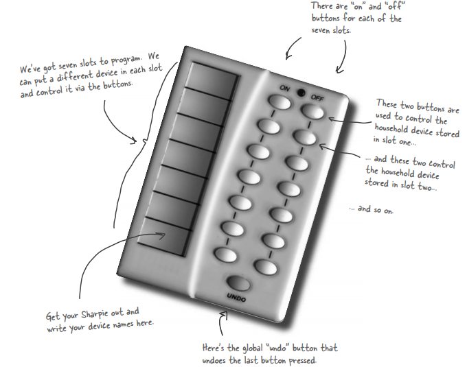

We’d like you to create an API for programming the remote so that each slot can be assigned to control a device or set of devices. 

Vendors have created JAVA classes to control home automation devices such as lights, fans, hot tubs, audio equipment, and other similar controllable appliances. 

**Note:** It is important that we be able to control the current devices, and also any future devices that the vendors may supply. 

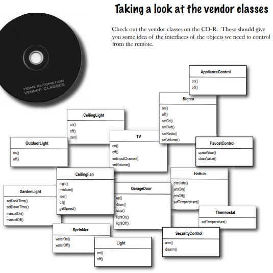

Vendor classes don’t just have a on() and off() methods, but here we’ve got methods like dim(), setTemperature(), setVolume(), setDirection().
Not only that, we can expect more vendor classes in the future with just as diverse methods. 

**Mary:** I think it’s important we view this as a separation of concerns: the remote should know how to interpret button presses and make requests, but it shouldn’t know a lot about home automation or how to turn on a hot tub. 

**Sue:** Sounds like good design. But if the remote is dumb and just knows how to make generic requests, how do we design the remote so that it can invoke an action that, say, turns on a light or opens a garage door? 

**Mary:** I’m not sure, but we don’t want the remote to have to know the specifics of the vendor classes. We don’t want the remote to consist of a set of if statements, like "if slot1 == Light, then light.on(), else if slot1 = Hottub then hottub.jetsOn()". We know that is a bad design. 

**Sue:** I agree. Whenever a new vendor class comes out, we’d have to go in and modify the code, potentially creating bugs and more work for ourselves!

### Command Pattern to the rescue

Decouples the Requester of action (→ Remote control) from the object that actually performs the action(→ instance of one of your vendor classes).

How is that possible? How can we decouple them? After all, when I press a button, the remote has to turn on a light. 

Introducing "command objects" into your design that encapsulates how to do a home automation task (like turning on a light) along with the object that needs to do it.  (say, the living room light object). 

Now, if we store a command object for each button slot, when the button is pressed we ask the command object to do some work. The remote doesn’t have any idea what the work is, it just has a command object that knows how to talk to the right object to get the work done. 

So, you see, the remote is decoupled from the light object! 

**Diagram to reflect the Command Pattern**

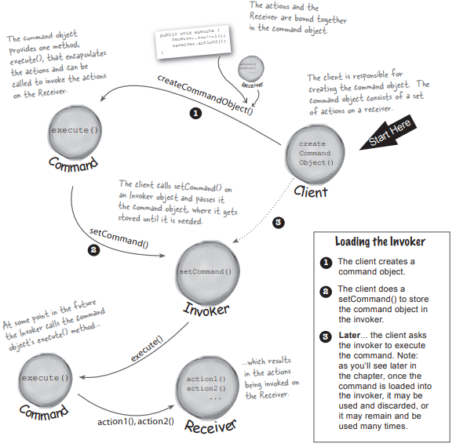

**Implementing the Command interface **

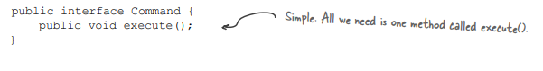

**Implementing a Command to turn a light on **

Referring to our set of vendor classes, the Light class has two methods: on() and off(). 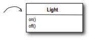  

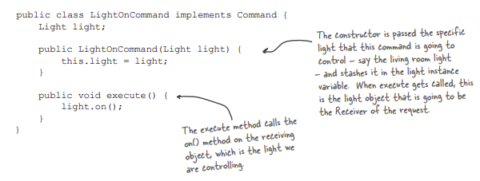  

**Implementing a Remote with single button**

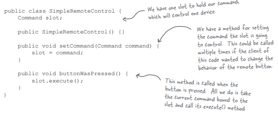  

**Testing Remote Control**

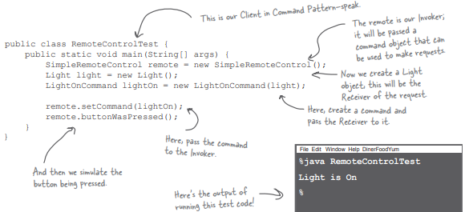

**Implementing a Command to open Garage door**

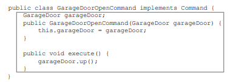

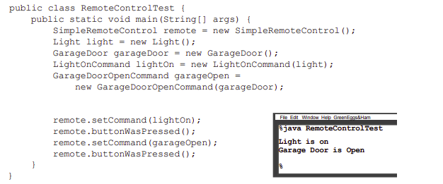

### Defining the command Pattern

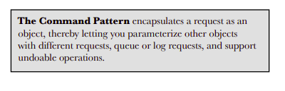 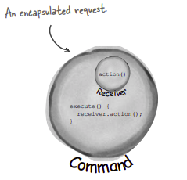  

The Command Pattern decouples an object, making a request from the one that knows how to perform it. 

A command object encapsulates a request by binding together a set of actions on a specific receiver. 

- To achieve this, it packages the actions and the receiver up into an object that exposes just one method, execute().   
- When called, execute() causes the actions to be invoked on the receiver.   
- From the outside, no other objects really know what actions get performed on what receiver; they just know that if they call the execute() method, their request will be serviced.  

We’ve also seen a couple examples of parameterizing an object with a command. In the simple remote control, we first loaded the button slot with a "light on" command and then later replaced it with a “garage door open” command. Your remote slot didn’t care what command object it had, as long as it implemented the Command interface.

An invoker makes a request of a Command object by calling its execute() method, which invokes those actions on the receiver.

Invokers can be parameterized with Commands, even dynamically at runtime.

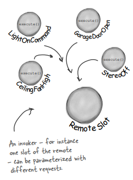

**The Command Pattern defined: the class diagram**  

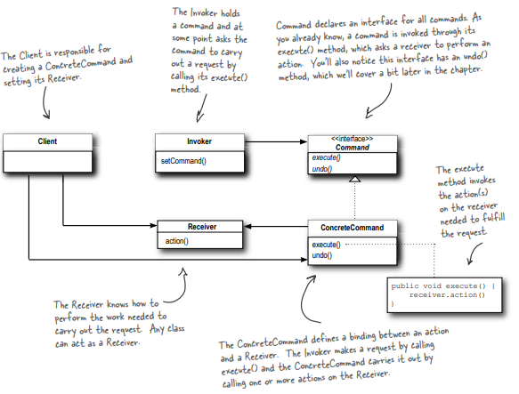

**Creating the actual Remote**

**Assigning commands to slots**

Like we did in SimpleRemote, we need to provide a way to assign commands to slots.

In our case we have seven slots, each with an "on" and “off ” button. So we might assign commands to the remote something like this: 

onCommands[0] = onCommand; offCommands[0] = offCommand;

**Case of a light in the living room and kitchen**

How do we make sure the right objects are turning on and off the right devices? 

When we create the commands to be loaded into the remote, we create one LightCommand that is bound to the living room light object and another that is bound to the kitchen light object. Remember, the receiver of the request gets bound to the command it’s encapsulated in. So, by the time the button is pressed, no one cares which light is which, the right thing just happens when the execute() method is called. 

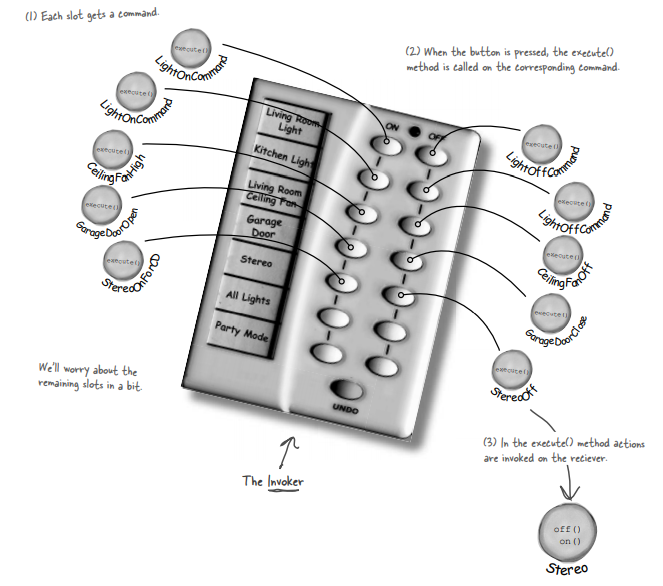

**Implementing the Remote Control**

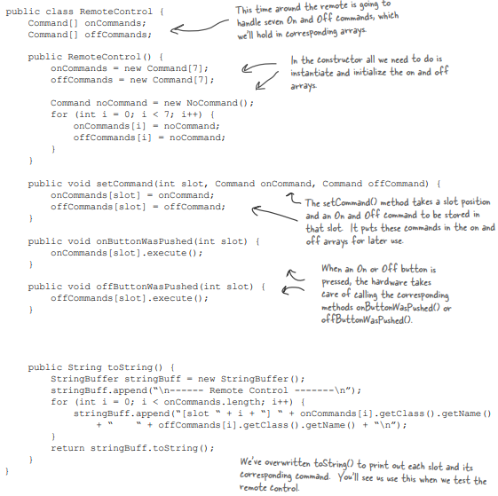

**In the remote control, we didn’t want to check to see if a command was loaded every time we referenced a slot. For instance, in the onButtonWasPushed() method, we would need code like this:**

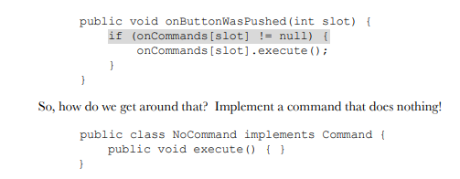

**Then, in our RemoteControl constructor, we assign every slot a NoCommand object by default and we know we’ll always have some command to call in each slot.**

**Implementing a new command : The Stereo Command**

Off command is easy, we just bind the Stereo to the off() method in the StereoOffCommand. On is a little more complicated; 

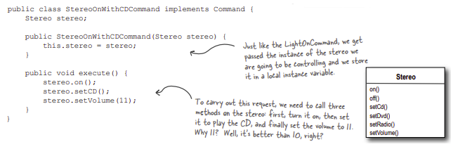


**Putting the Remote Control to test**

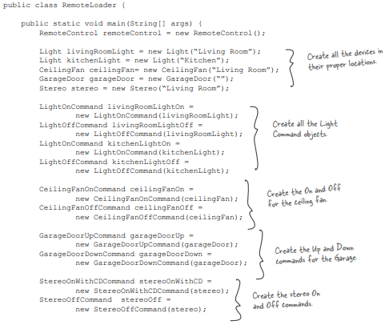

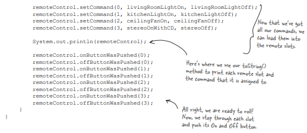

**Output**

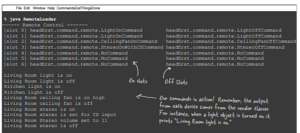

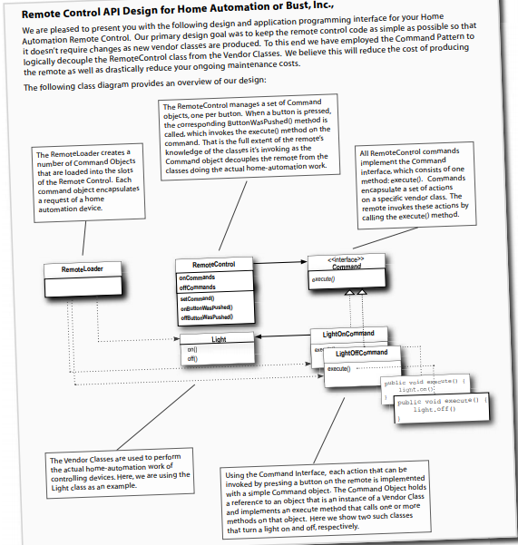

**Implementing the UNDO command**

1. When commands support undo, they have an undo() method that mirrors the execute() method. Whatever execute() last did, undo() reverses. So, first we need to add an undo() method to the Command interface:

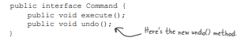

2. Let’s start with the LightOnCommand

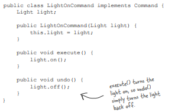

3. To add support for the undo button to the Remote Control class, we’ll add a new instance variable to track the last command invoked; then, whenever the undo button is pressed, we retrieve that command and invoke its undo() method. 

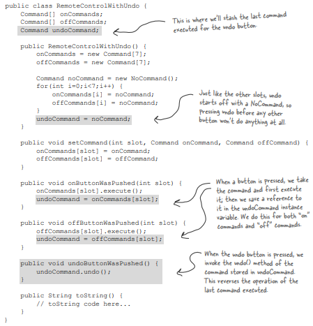

**Testing**

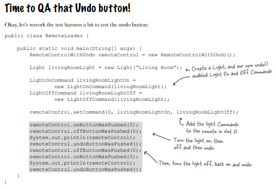

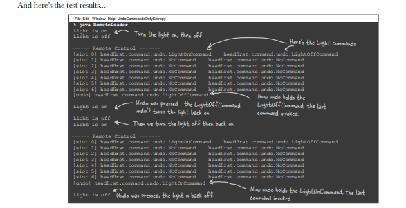

**Now consider the Ceiling Fan class**

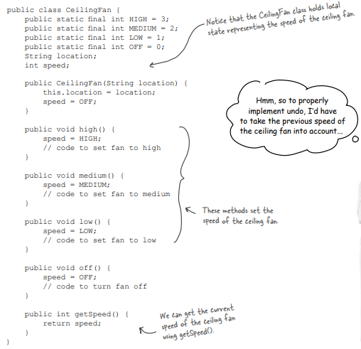

**Adding Undo to the ceiling fan commands**

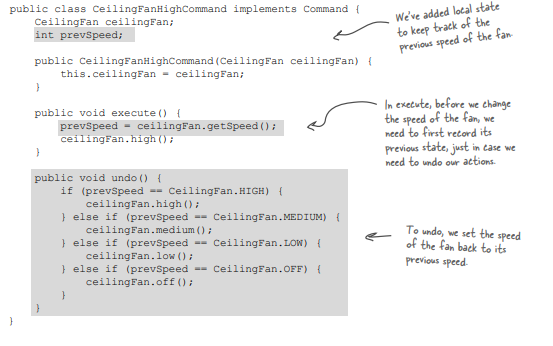

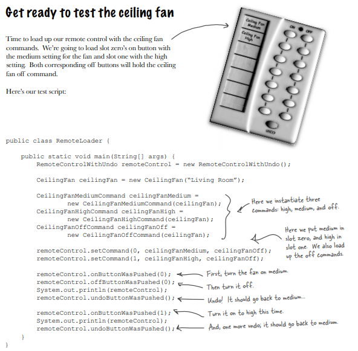

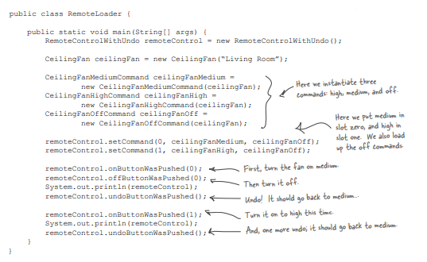

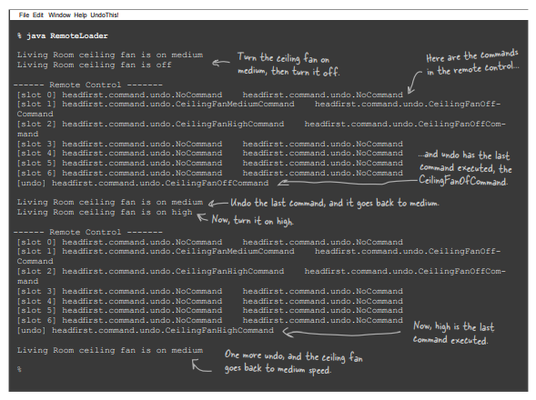

**Implementing a Party Mode Button**

That can have the lights dimmed, the stereo and TV turned on and the hot tub fired up

**Using a Macro Command** (They are a simple extension of Command that allow multiple commands to be invoked)

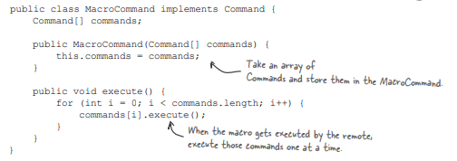

**1. First we create the set of commands we want to go into the macro:**

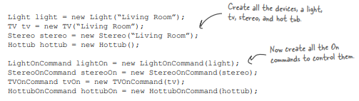

**2. Next we create two arrays, one for the On commands and one for the Off commands, and load them with the corresponding commands:**

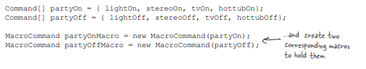

**3. Then we assign MacroCommand to a button like we always do:**

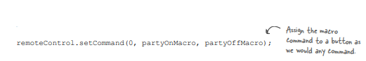

**4. Finally, we just need to push some buttons and see if this works.**

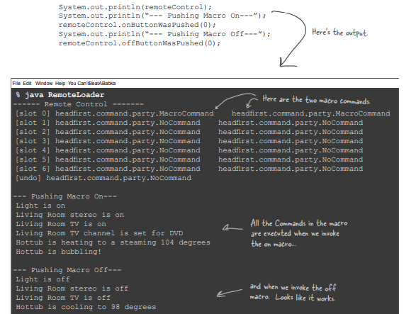

**Undo for macro command**

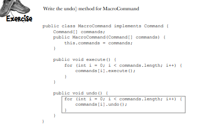

**Q: Could I have just implemented Party Mode as a Command by creating a PartyCommand and putting the calls to execute the other Commands in the PartyCommand’s execute() method?**

**A:** You could; however, you’d essentially be "hardcoding" the party mode into the PartyCommand. Why go to the trouble? With the MacroCommand, you can decide dynamically which Commands you want to go into the PartyCommand, so you have more flexibility using MacroCommands. In general, the MacroCommand is a more elegant solution and requires less new code. 

**Q: Do I always need a receiver? Why can’t the command object implement the details of the execute() method?**

**A:** You’ll no longer have the same level of decoupling between the invoker and receiver, nor will you be able to parameterize your commands with receivers.

Currently you can decide dynamically which Receiver you want to go into the Command.

Ex: Kitchen Light and Bedroom Light. Both can be passed to a LightOnCommand. But if we don’t expect a receiver then, we’ll have to create 2 different LightOnCommand for Kitchen and Bedroom which is again a bad design.

**Q: How can I implement a history of undo operations? In other words, I want to be able to press the undo button multiple times.**

**A:** Great question! It’s pretty easy actually; instead of keeping just a reference to the last Command executed, you keep a stack of previous commands. Then, whenever undo is pressed, your invoker pops the first item off the stack and calls its undo() method.

### More uses of the Command Pattern: 

**1) queuing requests**  

We can apply it to many useful applications such as schedulers, thread pools and job queues, to name a few. 

Imagine a job queue: you add commands to the queue on one end, and on the other end sit a group of threads. 

Threads run the following script: 
- they remove a command from the queue,  
- call its execute() method,   
- wait for the call to finish,  
- then discard the command object and retrieve a new one.  

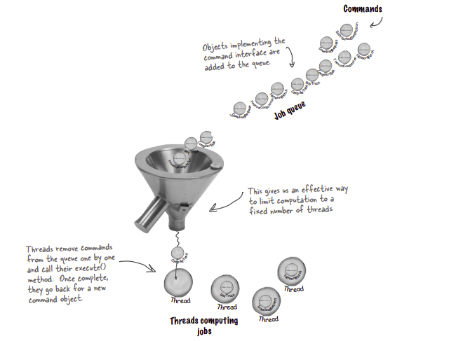

Note that the job queue classes are totally decoupled from the objects that are doing the computation. One minute a thread may be computing a financial computation, and the next it may be retrieving something from the network. The job queue objects don’t care; they just retrieve commands and call execute(). Likewise, as long as you put objects into the queue that implement the Command Pattern, your execute() method will be invoked when a thread is available.

**2) logging requests**  
The semantics of some applications require that we log all actions and be able to recover after a crash by reinvoking those actions. The Command Pattern can support these semantics with the addition of two methods: store() and load(). 

How does this work? As we execute commands, we store a history of them on disk. When a crash occurs, we reload the command objects and invoke their execute() methods in batch and in order. 

Now, this kind of logging wouldn’t make sense for a remote control; however, there are many applications that invoke actions on large data structures that can’t be quickly saved each time a change is made. By using logging, we can save all the operations since the last checkpoint, and if there is a system failure, apply those operations to our checkpoint. 

Take, for example, a spreadsheet application: we might want to implement our failure recovery by logging the actions on the spreadsheet rather than writing a copy of the spreadsheet to disk every time a change occurs. In more advanced applications, these techniques can be extended to apply to sets of operations in a transactional manner so that all of the operations complete, or none of them do.

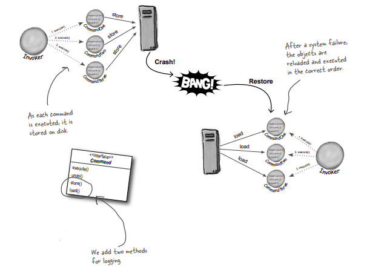

**Example of a restaurant**

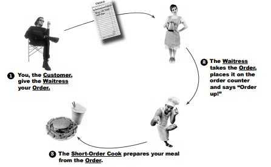

**What actually happens:**

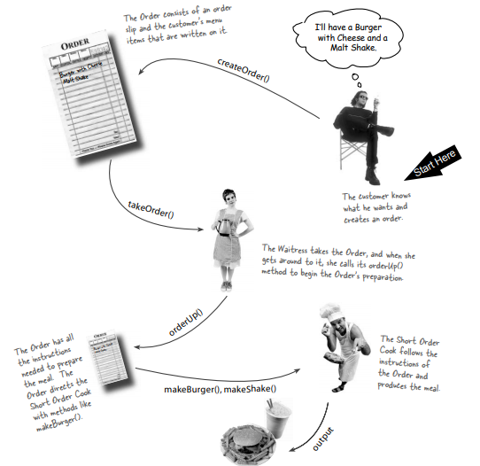

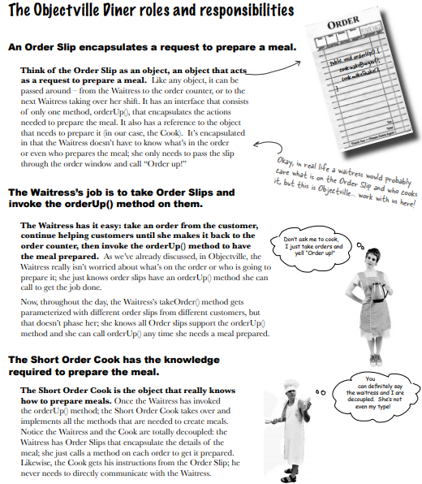

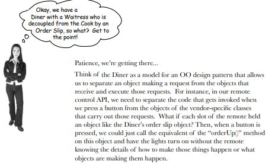

Client			→		Customer

Command		→		Order

Receiver		→		Cook

Invoker (Remote)	→		Waitress

setCommand()	→		takeOrder()

execute()		→		orderUp()

``java
//Order Interface → Command interface
public interface Order{
	public void OrderUp();
}

//LightOnCommand → PizzaOrder 
class PizzaOrder implements Order{
  Pizza p;
  public PizzaOrder(Pizza pizza){
    p = pizza;
  }

  public void OrderUp(){
    p.prepareBase();
    p.cutVeggies();
    p.bake();
    p.cutSlices();
  }
}

public class Waitress{
	Order order;
	
	public void takeOrder(Order o){
		Order = o;
  }
}


```
