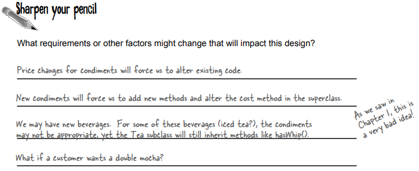
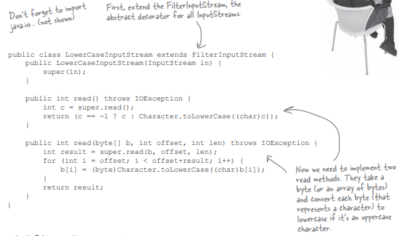

# Decorator Pattern  

**Starbuzz Coffee Shop** serves 4 types of Coffee:
- House Blend  
- Dark Roast		  
- Decaf		  
- Expresso  

Design classes to give the description and cost of beverages.

Now you can also add several condiments like steamed milk, soy, mocha, and whipped milk. Starbuzz charges a bit for each of these. Here’s their first attempt at new design:

	

 

**Another possible solution**

  

 

Problems with using inheritance for our beverage plus condiment pricing scheme:

class explosions, rigid designs, or we add functionality to the base class that isn’t appropriate for some of the subclasses. 

While inheritance is powerful, it doesn’t always lead to the most flexible or maintainable designs. **So, how to achieve reuse if not through inheritance?** There are ways of "inheriting" behavior at runtime through composition and delegation. 

When I inherit behavior by subclassing, that behavior is set statically at compile time. In addition, all subclasses must inherit the same behavior.

If however, I can extend an object’s behavior through composition, then I can do this dynamically at runtime. It is possible for me to add multiple new responsibilities to objects through this technique.

### The Open Closed Principle

**Constructing a Drink with Decorators**

### Defining the Decorator Pattern

**Decorating our Beverages**

**Q) Instead of using inheritance in this pattern, we were going to rely on composition. But as we see the CondimentDecorator is extending the Beverage class. Why?**

**A)** Decorators need the same interface/supertype (either through inheritance or interface implementation) as the components they wrap because they need to stand in place of the component. So here we’re using inheritance to achieve the type matching, but we aren’t using inheritance to get behavior.

**Q) But where does the behavior come in?**

When we compose a decorator with a component, we are adding new behavior. We are acquiring new behavior not by inheriting it from a superclass, but by composing objects together (i.e. decorators with the base components as well as other decorators)

If we rely on inheritance, then our behavior can only be determined statically at compile time. In other words, we get only whatever behavior the superclass gives us or that we override. With composition, we get a whole lot more flexibility as we can mix and match condiments and beverages any way we like... at runtime.

And as I understand it, we can implement new decorators at any time to add new behavior. If we relied on inheritance, we’d have to go in and change existing code any time we wanted new behavior

**Order for a "double mocha soy HouseBlend(latte) with whip" beverage.**

 

### Writing the Code

**The Beverage class**

  

**Abstract class for the Condiments (Decorator)**  

  

**Let’s implement some beverages.**  

**Now it’s time to implement the concrete decorators.**

**Q: Can decorators know about the other decorations in the chain? Say, I wanted my getDecription() method to print "Whip, Double Mocha" instead of “Mocha, Whip, Mocha”? That would require that my outermost decorator know all the decorators it is wrapping.**

**A:** Decorators are meant to add behavior to the object they wrap. When you need to peek at multiple layers into the decorator chain, you are starting to push the decorator beyond its true intent. Nevertheless, such things are possible. Imagine a CondimentPrettyPrint decorator that parses the final decription and can print "Mocha, Whip, Mocha" as “Whip, Double Mocha.” Note that getDecription() could return an ArrayList of descriptions to make this easier.

**Starbuzz introduces sizes to their menu: Tall, Grande, and Venti sizes**

**(for us normal folk: small, medium, and large).**

**So they’ve added two methods to the Beverage class: setSize() and getSize().**

**How would you alter the decorator classes if they’d also like to charge for the condiments according to size, so for instance, Soy costs 10¢, 15¢, and 20¢ respectively for tall, grande, and venti coffees.**

### Real World Decorators: Java I/O

Here’s a typical set of objects that use decorators to add functionality to reading data from a file:

**Writing your own Java I/O Decorator**

**How about this: write a decorator that converts all uppercase characters to lowercase in the input stream.**

**public int read()**
**(specified in in class InputStream)**
Reads the next byte (8 bits) of data from this input stream. The value byte is returned as an int in the range 0 to 255. If no byte is available because the end of the stream has been reached, the value -1 is returned.
So if the file in question happens to be a text file, and the first character is a capital 'A', read() will return 65.

[https://stackoverflow.com/questions/38343729/why-does-read-read-one-byte-at-a-time-if-char-is-2-bytes](https://stackoverflow.com/questions/38343729/why-does-read-read-one-byte-at-a-time-if-char-is-2-bytes)

**public int read(byte[] b, int off, int len)**
- **b - the buffer into which the data is read**
- **off - the start offset in the destination array b**
- **len - the maximum number of bytes read**
Reads up to len bytes of data from this input stream into an array of bytes b, starting from position off in destination array b. 
Returns the total number of bytes read into the buffer, or -1 if there is no more data because the end of the stream has been reached.

**Test out your new Java I/O Decorator**

**Decorator Pattern Negatives**

It is a great pattern for creating flexible designs staying true to the Open-Closed Principle, but has a few disadvantages:

1. Sometimes it adds a lot of small classes to a design and this occasionally results in a design that’s less than straightforward for others to understand. 

Ex: Take the Java I/O libraries. These are notoriously difficult for people to understand at first. But if they just saw the classes as a set of wrappers around an InputStream, life would be much easier. 

2. Introducing decorators can increase the complexity of the code needed to instantiate the component. Once you’ve got decorators, you’ve got to not only instantiate the component, but also wrap it with who knows how many decorators. 

