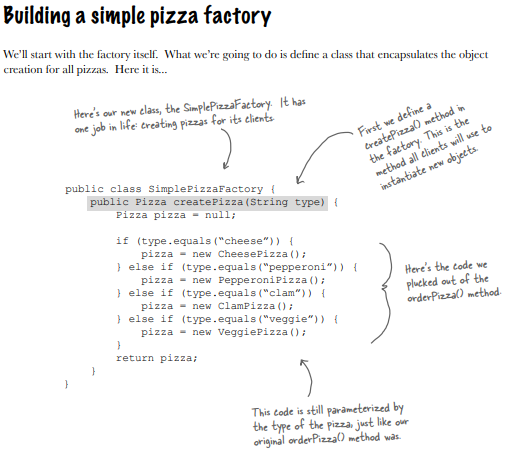
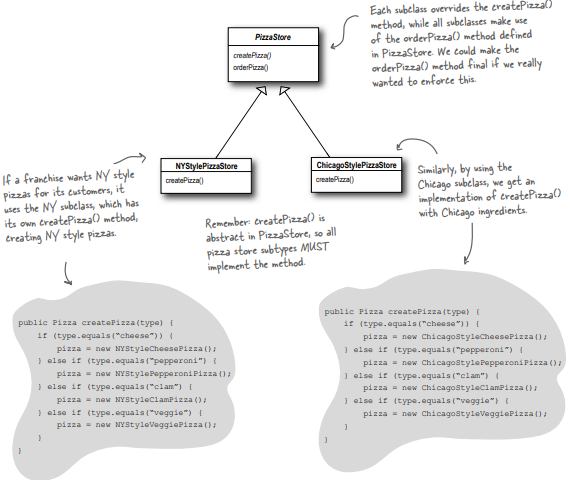
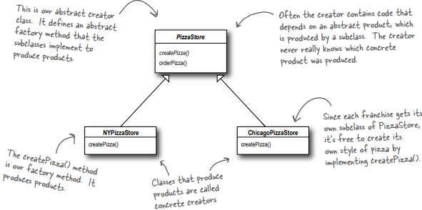
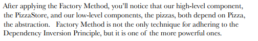

**Factory Pattern**

Here we’ve got several concrete classes being instantiated, and the decision of which to instantiate is made at runtime depending on some set of conditions.

**We aren’t supposed to program to an implementation but every time we use new, that’s exactly what we are doing, right?**

Yes, when you use ‘new’ you are instantiating a concrete class, so that’s an implementation, not an interface. Tying code to a concrete class can make it more fragile and less flexible.

When you see code like this, you know that when it comes time for changes or extensions, you’ll have to reopen this code and examine what needs to be added (or deleted). Often this kind of code ends up in several parts of the application making maintenance and updates more difficult and error-prone.

Clearly, dealing with which concrete class is instantiated is really messing up our orderPizza() method and preventing it from being closed for modification. But now that we know what is varying and what isn’t, it’s probably time to encapsulate it.

** Remember, our first principle deals with change and guides us to identify the aspects that vary and separate them from what stays the same

**Building a simple pizza factory **

**Q: What’s the advantage of this? It looks like we are just pushing the problem off to another object. **

A: One thing to remember is that the SimplePizzaFactory may have many clients. We’ve only seen the orderPizza() method; however, there may be a PizzaShopMenu class that uses the factory to get pizzas for their current description and price. We might also have a HomeDelivery class that handles pizzas in a different way than our PizzaShop class but is also a client of the factory. So, by encapsulating the pizza creating in one class, we now have only one place to make modifications when the implementation changes. Don’t forget, we are also just about to remove the concrete instantiations from our client code!

**Q: I’ve seen a similar design where a factory like this is defined as a static method. What is the difference? **

A: Defining a simple factory as a static method is a common technique and is often called a static factory. Why use a static method? Because you don’t need to instantiate an object to make use of the create method. But remember it also has the disadvantage that you can’t subclass and change the behavior of the create method.

**The Simple Factory defined **

The Simple Factory isn’t actually a Design Pattern; it’s more of a programming idiom.  

Think of Simple Factory as a warm up. Next, we’ll explore two heavy duty patterns that are both factories. 

**Franchising the pizza store **

We need to open PizzaStore franchise in New York, Chicago, and California.

What varies among the regional PizzaStores is the style of pizzas they make – 

New York Pizza has thin crust

Chicago Pizza has thick and so on – and we are going to push all these variations into the createPizza() method and make it responsible for creating the right kind of pizza.

**A framework for the pizza store **

What we’re going to do is put the createPizza() method back into PizzaStore, but this time as an abstract method, and then create a PizzaStore subclass for each regional style. 

**Now we’re going to have a subclass for each regional type (NYPizzaStore, ChicagoPizzaStore, CaliforniaPizzaStore), each with its own pizza variations.**

**In other words, it’s decoupled!**

**Let’s make a PizzaStore **

*** Note that the orderPizza() method in the superclass has no clue which Pizza we are creating; it just knows it can prepare, bake, cut, and box it!**

**What have we actually done ?**

**How an order is completed ?**

**Implementing abstract PIZZA class**

**Implementing concrete PIZZA classes**

**Let’s Go on a Test Driveee…...**

**It’s finally time to meet the Factory Method Pattern **

The Factory Method Pattern encapsulates object creation by letting subclasses decide what objects to create.** **

**This means that the creator class is written without knowledge of the actual products that will be created, which is decided purely by the choice of the subclass that is used**

**Look at the class diagrams**

**Another perspective: parallel class hierarchies **

Another way to look at this pattern as a framework is in the way it encapsulates product knowledge into each creator. 

Let’s look at the two parallel class hierarchies and see how they relate:

** Factory Method Pattern defined**

**Q: What’s the advantage of the Factory Method Pattern when you only have one ConcreteCreator? **

**A: **This  pattern is useful if you’ve only got one concrete creator because you are decoupling the implementation of the product from its use. If you add additional products or change a product’s implementation, it will not affect your Creator (because the Creator is not tightly coupled to any ConcreteProduct). 

**Q: Are the factory method and the Creator always abstract? **

**A: **No, you can define a default factory method to produce some concrete product. Then you always have a means of creating products even if there are no subclasses of the Creator.

**Q: Your parameterized types don’t seem "typesafe." I’m just passing in a String! What if I asked for a “CalmPizza”? **

**A: **You are certainly correct and that would cause, what we call in the business, a "runtime error." There are several other more sophisticated techniques that can be used to make parameters more “type safe”, or, in other words, to ensure errors in parameters can be caught at compile time. For instance, you can create objects that represent the parameter types, use static constants, or, in Java 5, you can use enums.

**Q: I’m still a bit confused about the difference between Simple Factory and Factory Method. They look very similar, except that in Factory Method, the class that returns the pizza is a subclass. Can you explain?** 

**A:** You’re right that the subclasses do look a lot like Simple Factory, however think of Simple Factory as a one shot deal, while with Factory Method you are creating a framework that lets the subclasses decide which implementation will be used. 

For example, the orderPizza() method in the Factory Method provides a general framework for creating pizzas that relies on a factory method to actually create the concrete classes that go into making a pizza. By subclassing the PizzaStore class, you decide what concrete products go into making the pizza that orderPizza() returns. 

***** Compare that with SimpleFactory, which gives you a way to encapsulate object creation, but doesn’t give you the flexibility of the Factory Method because there is no way to vary the products you’re creating.**

Ex: If it’s a single factory, then anyone in new york would have ordered a Chicago style Pizza

---------------------------------------------------------------------------------------------------------------------------

**Learning so far….**

**Applying the principle "encapsulate what varies"**

When you have code that instantiates concrete classes, and this is an area of frequent change. Use "factories" that allows you to encapsulate this behavior of instantiation (the code that creates objects).

**Benefits of these "factories" ? **

* Avoids duplication in code and provide one place to perform maintenance. 

* Clients depend only upon interfaces rather than concrete classes required to instantiate objects. 

* Allows to program to an interface, not an implementation, and that makes code more flexible and extensible in the future. 

**Q: By encapsulating object creation we are coding to abstractions and decoupling client code from actual implementations. But the factory code must still use concrete classes to instantiate real objects ?**

**A: **Object creation is a reality of life; we must create objects or we will never create a single Java program. But, with knowledge of this reality, we can design our code so that we have corralled this creation code. Once corralled, we can protect and care for the creation code. 

**A very dependent PizzaStore **

**Looking at Object dependencies**

All the pizza objects are created in PizzaStore class instead of delegating to a factory. 

Diagram representing PizzaStore & all the objects it depends on:

**The Dependency Inversion Principle **

It’s pretty clear that reducing dependencies to concrete classes in our code is a "good thing."

**** This is a guideline you should strive for, rather than a rule you should follow all the time. Clearly, every single Java program ever written violates these guidelines! **

But, if you internalize these guidelines and have them in the back of your mind when you design, you’ll know when you are violating the principle and you’ll have a good reason for doing so. 

For instance, if you have a class that isn’t likely to change, and you know it, then it’s not the end of the world if you instantiate a concrete class in your code. 

**Meanwhile, back at the PizzaStore…**

**We now need to ensure that each franchise is using quality ingredients. You’re going to build a factory that produces them and ships them to your franchises! **

**All Objectville’s Pizzas are made from the same components, but each region has a different implementation of those components.**

**In total, these three regions make up ingredient families, with each region implementing a complete family of ingredient**

**Each family consists of a type of dough, a type of sauce, a type of cheese, and a seafood topping (along with a few more we haven’t shown, like veggies and spices).**

**Building the ingredient factory**

Responsible for creating each ingredient i.e. dough, sauce, cheese… in the ingredient family. 

**Building the New York ingredient factory **

**Note: We have Implemented a set of ingredient classes to be used with the factory, like ReggianoCheese, RedPeppers, and ThickCrustDough. These classes can be shared among regions where appropriate.**

**Reworking the pizzas... To use the factory produced ingredients**

**Revisiting our pizza stores **

**What have we done ?**

**We provided a means of creating a family of ingredients for pizzas by introducing a new type of factory called an Abstract Factory.**

**By writing code that uses this interface, we decouple our code from the actual factory that creates the products. That allows us to implement a variety of factories that produce products meant for different contexts – such as different regions, different operating systems, or different look and feels.**

**Because our code is decoupled from the actual products, we can substitute different factories to get different behaviors (like getting marinara instead of plum tomatoes).**

**Ordering a Pizza**

** Abstract Factory Pattern defined **

**NOTE: *** Each method in the Abstract Factory actually looks like a Factory Method (createDough(), createSauce(), etc.). Each method is declared abstract and the subclasses override it to create some object. Isn’t that Factory Method?**

**Summarizing Factory Patterns**

* All factories encapsulate object creation.

* Hence they promote loose coupling by reducing the dependency of your application on concrete classes.

(in other words decoupling applications from specific implementations)

---------------------------------------------------------------------------------------------------------------------------

**Simple Factory:**

* **While not a bonafide design pattern, it is a simple way to decouple your clients from concrete classes. **

**Factory Method: **

* **Relies on inheritance: object creation is delegated to subclasses which implement/override a factory method to create objects. **

* By using a subclass to do the creation for you, clients only need to know the abstract type they are using, the subclass worries about the concrete type. 

**Abstract Factory: **

* **Relies on object composition: object creation is implemented in methods exposed in the factory interface. **

(i.e provides an abstract type for creating a family of products and subclasses of this type define how those products are produced)

* To use the factory, you instantiate one and pass it into some code that is written against the abstract type. So, like Factory Method, clients are decoupled from the actual concrete products they use.

**Advantage **is that you group together a set of related products

**Tradeoff **What happens if you need to extend that set of related products, to say add another one? Doesn’t that require changing your interface? 

That’s true; interface has to change if new products are added, and changing the interface means you have to go in and change the interface of every subclass! 

---------------------------------------------------------------------------------------------------------------------------

**Abstract Factory **needs a big interface because it is used to create entire families of products. 

**Factory Method **only creates one product, so it doesn’t really need a big interface, you just need one method. 

---------------------------------------------------------------------------------------------------------------------------

**Abstract Factory : **Use whenever you have families of products you need to create and you want to make sure your clients create products that belong together. 

**Factory Method: **Used to decouple your client code from the concrete classes you need to instantiate, or if you don’t know ahead of time all the concrete classes you are going to need. 

---------------------------------------------------------------------------------------------------------------------------

The intent of **Abstract Factory **is to provide an interface to create families of related objects without having to depend on their concrete classes. 

The intent of **Factory Method** is to allow a class to defer instantiation to its subclasses. 

---------------------------------------------------------------------------------------------------------------------------

**The Dependency Inversion Principle guides us to avoid dependencies on concrete types and to strive for abstractions. **

**Factories are a powerful technique for coding to abstractions, not concrete classes.**

**         **

