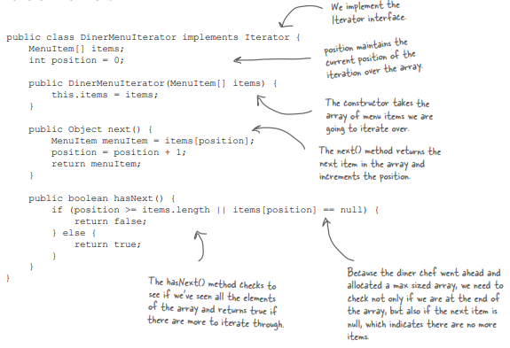

# Iterator & Composite Pattern

### Problem Statement: Objectville Diner and Objectville Pancake House Merger

Now we can get those delicious pancake breakfasts at the Pancake House and those yummy lunches at the Diner all in one place. 

They want to use Pancake House menu as the breakfast menu and the Diner’s menu as the lunch menu....They’ve agreed on an implementation for the menu items... but we can’t agree on how to implement our menus. 

**Objectville Diner** used an ArrayList to hold his menu items, and   
**Objectville Pancake House** used an Array. 

Neither one of us is willing to change our implementations... we just have too much code written that depends on them.

**Implementation of the Pancake House menu**

I used an ArrayList so I can easily expand my menu.

**Implementation of the Diner menu**

I used a REAL Array so I can control the maximum size of my menu and get my MenuItems without having to use a cost.

**What’s the problem with having two different menu representations?**

Let’s implement a client (a Java-enabled waitress) that uses the two menus. 

**Java-Enabled Waitress Specification**  

**What now?** If the two menus implement the same interface, we can minimize the concrete references in Waitress code & get rid of multiple loops required to iterate over both menus. 

**Well, how are we going to do that?** Encapsulate what varies. It’s obvious what is changing here: the iteration caused by different collections of objects being returned from the menus. 

**Can we encapsulate the iteration?**

### Meet the Iterator Pattern

Iterator Pattern relies on an interface called Iterator. Here’s one possible Iterator interface:

Now, once we have this interface, we can implement Iterators for any kind of collection of objects: arrays, lists, hashtables, ...pick your favorite collection of objects. 

Implementing the Iterator for the Array used in the DinerMenu, would look like this:

**To add an Iterator to the DinerMenu we first need to define the Iterator Interface:**

**And now we need to implement a concrete Iterator that works for the Diner menu:**

**Reworking the Diner Menu with Iterator**

**Fixing up the Waitress code**

**Testing our code**

* An Iterator allows access to an aggregate’s elements without exposing its internal structure. 

* An Iterator takes the job of iterating over an aggregate and encapsulates it in another object. 

**What have we done?**

**Now that we’ve seen how to build an iterator from scratch, we’re going to switch to using the Java Iterator interface.**

We just need to change the interface that both PancakeHouseMenuIterator and DinerMenuIterator extend, right? Almost... actually, it’s even easier than that. 

ArrayList has an iterator() method that returns an iterator. In other words, we never needed to implement our own iterator for ArrayList. 

However, we’ll still need our implementation for the DinerMenu because it relies on an Array, which doesn’t support the iterator() method (or any other way to create an array iterator).

**Changes to make things work with java.util.Iterator**

**→ PancakeHouseMenu**

**Delete PancakeHouseMenuIterator class and change one line of PancakeHouseMenu:**

**→ DinerMenu**

**Making some improvements…**

These two menus implement the same exact set of methods, but they aren’t implementing the same Interface. We’re going to fix this and free the Waitress from any dependencies on concrete Menus.

We just need to give the Menus a common interface and rework the Waitress a little.

**Solved 2 problems**  

### Iterator Pattern defined

**Impact of using Iterator**

* Provides a uniform way of accessing the elements of all your aggregate objects, you can write **polymorphic code** that works with any of these aggregates – just like the printMenu() method, which doesn’t care if the menu items are held in an Array or ArrayList, as long as it can get hold of an Iterator. 

* The Iterator Pattern takes the responsibility of traversing elements and gives that responsibility to the iterator object, not the aggregate object. This not only keeps the aggregate interface and implementation simpler, it removes the responsibility for iteration from the aggregate and keeps the aggregate focused on the things it should be focused on (managing a collection of objects), not on iteration.

**Q: I’ve heard about "internal" iterators and “external” iterators. What are they? Which kind did we implement ?**  
**A:** We implemented an external iterator, which means that the client controls the iteration by calling next() to get the next element. An internal iterator is controlled by the iterator itself. In that case, because it’s the iterator that’s stepping through the elements, you have to tell the iterator what to do with those elements as it goes through them. That means you need a way to pass an operation to an iterator. 

Internal iterators are less flexible than external iterators because the client doesn’t have control of the iteration. However, some might argue that they are easier to use because you just hand them an operation and tell them to iterate, and they do all the work for you. 

**Q: Could I implement an Iterator that can go backwards as well as forwards?**  
**A:** Definitely. In that case, you’d probably want to add two methods, one to get to the previous element, and one to tell you when you’re at the beginning of the collection of elements. 

Java’s Collection Framework provides another type of iterator interface called ListIterator. This iterator adds previous() and a few other methods to the standard Iterator interface. It is supported by any Collection that implements the List interface. 

**Q: Who defines the ordering of the iteration in a collection like Hashtable, which are inherently unordered?**  
**A:** Iterators imply no ordering. The underlying collections may be unordered as in a hashtable; they may even contain duplicates. So ordering is related to both the properties of the underlying collection and to the implementation.

**Q: I’ve seen an Enumeration interface in Java; does that implement the Iterator Pattern?**  
**A:** The java.util. Enumeration is an older implementation of Iterator that has since been replaced by java.util.Iterator. Enumeration has two methods, hasMoreElements(), corresponding to hasNext(), and nextElement(), corresponding to next(). However, you’ll probably want to use Iterator over Enumeration as more Java classes support it. 

### Single Responsibility Design Principle

What if we allowed our aggregates (i.e. DinerMenu & PanCakeHouseMenu) to implement 

1. their internal collections and related operations 

2. the iteration methods

**Why is that so bad?**

Well, to see why, you first need to recognize that when we allow a class to not only take care of its own business (managing some kind of aggregate) but also take on more responsibilities (like iteration) then we’ve given the class two reasons to change. 

It can change if the collection changes in some way, and it can change if the way we iterate changes.

We know we want to avoid change in a class – modifying code provides all sorts of opportunities for problems to creep in. Having two ways to change increases the probability the class will change in the future, and when it does, it’s going to affect two aspects of your design. 

**The solution?**

Every responsibility of a class is an area of potential change. More than one responsibility means more than one area of change. 

**Examine these classes and determine which ones have multiple responsibilities.**

 

### Merger with Objectville Café for Dinner Menu

**Taking a look at the Café Menu**

**Think how to Rework the Café Menu code**

**For Hashtable we can get an Iterator for the values (which are the MenuItems).**

**Adding the Café Menu to the Waitress**

****NOTE:** By giving the Waitress an Iterator we have decoupled her from the implementation of the menu items, so we can easily add new Menus if we want.

**Breakfast, lunch AND dinner**

### Iterators and Collections

Java Collections Framework is just a set of classes and interfaces, including ArrayList, which we’ve been using, and many others like Vector, LinkedList, Stack, and PriorityQueue. 

Each of these classes implements the java.util.Collection interface, which contains a bunch of useful methods for manipulating groups of objects. 

**Let’s take a quick look at the interface:**

**Java 5 (No need of even an Iterator)**

Java 5 includes a new form of the for statement, called for/each, that lets you iterate over a collection or an array without creating an iterator explicitly. 

Here’s how you iterate over an ArrayList<MenuItem> using for/each:

**Still violating the Open Closed Principle?**

Every time we add a new menu we are going to have to open up the Waitress implementation and add more code.

We have done a great job of decoupling the menu implementation and extracting the iteration into an iterator. 

But we still are handling the menus with separate, independent objects – we need a way to manage them together.

**Now they want to add a dessert submenu (menus within menus)**

We need to make the dessert menu an element of the DinerMenu collection, but that won’t work as it is now implemented.

**→ We need some kind of a tree shaped structure that will accommodate menus, submenus and menu items.**

**→ We may need to be able to traverse the items in a more flexible manner.**

**For instance: We might need to iterate over only the Diner’s dessert menu, or we might need to iterate over the Diner’s entire menu, including the dessert submenu.**

### The Composite Pattern defined

**→ By putting menus and items in the same tree structure we create a part-whole hierarchy; that is, a tree of objects that is made of parts (menus and menu items) but that can be treated as a whole, like one big über menu.**

**→ Once we have our über menu, we can use this pattern to treat "individual objects and compositions uniformly." What does that mean?**

* **Any menu is a "composition" because it can contain both other menus and menu items.**

* **The individual objects are just the menu items – they don’t hold other objects.**

**---------------------------------------------------------------------------------------------------------------------------**

**Using a composite structure, we can write some simple code that apply the same operations (like printing!) over both composites and individual objects.**

**In other words, in most cases we can ignore the differences between compositions of objects and individual objects.**

### Composite Pattern Class Diagram

**Q: Every leaf & composite object has the same interface. At times you’ll have objects for which some of the method calls don’t make sense. So how do you handle that?**

Sometimes you can just do nothing, or return null or false – whatever makes sense in your application. 

Other times you’ll want to throw an exception. Of course, then the client has to be willing to do a little work and make sure that the method call didn’t do something unexpected.

If you’re a little creative you can structure your methods so that the default implementations do something that does make sense. For instance, if the client is calling getChild(), on the composite this makes sense. And it makes sense on a leaf too, if you think of the leaf as an object with no children. 

**Q: Some clients are so worried about this issue, that they require separate interfaces for different objects so they aren’t allowed to make nonsensical method calls. Is that still the Composite Pattern?**

Yes. It’s a much safer version of the Composite Pattern, but it requires the client to check the type of every object before making a call so the object can be cast correctly. 

**Designing Menus with Composite**

**Let’s get an idea of what the menu composite is going to look like at runtime:**

**Implementing the Menu Component**

**Implementing the Menu Item**

**Implementing the Composite Menu**

**We were supposed to apply the same operations to a composite and to a leaf.**  
**Because menu is a composite of both Menu Items and other Menus, its print() method should print everything it contains.**   
**If it didn’t then we have to iterate through the entire composite and print each item.**   

 

**Getting ready for a test drive…update the Waitress code**

**Now for the test drive…**

**		**

**Violating the One Class, One Responsibility principle**

Composite Pattern takes the Single Responsibility design principle and trades it for transparency. 

**What’s transparency?** Well, by allowing the Component interface to contain child management operations  (like add(), remove() and getChild()) and the leaf operations (like price() and description()), a client can treat both composites and leaf nodes uniformly; so whether an element is a composite or leaf node becomes transparent to the client.

With this, we lose a bit of safety because a client might try to do something meaningless on an element (like try to add a menu to a menu item). This is a design decision;

 

We can take the design in the other direction and separate out the responsibilities into interfaces. This would make our design safe (any inappropriate calls on elements would be caught at compile time or runtime), but we’d lose the uniform treatment and our code would have to use conditionals and the instanceof operator.

We are guided by design principles, but we always need to observe the effect they have on our designs. Sometimes we purposely violate the principle. 

In some cases, however, this is a matter of perspective; for instance, it might seem incorrect to have child management operations in the leaf nodes (like add(), remove() and getChild()), but then you can always shift your perspective and see a leaf as a node with zero children.

### Implementing Composite Iterator

There may be cases when client needs to iterate over the entire composite. It’s got the job of iterating over the MenuItems in the component, and of making sure all the child Menus (and child child Menus, and so on) are included.

For instance, the Waitress needs to iterate over an entire composite if she wants to go through the entire menu and pull out vegetarian items. 

To implement a Composite iterator, let’s add a createIterator() method in every component. We’ll start with the abstract MenuComponent class: 

**Now we need to implement this method in the Menu and MenuItem classes:**

When we wrote the print() method in the MenuComponent class we used an iterator to step through each item in the component and if that item was a Menu (rather than a MenuItem), then we recursively called the print() method to handle it. In other words, the MenuComponent handled the iteration itself, internally.

With this code we are implementing an external iterator so there is a lot more to keep track of. For starters, an external iterator must maintain its position in the iteration so that an outside client can drive the iteration by calling hasNext() and next(). But in this case, our code also needs to maintain that position over a composite, recursive structure. That’s why we use stacks to maintain our position as we move up and down the composite hierarchy.

### The Null Iterator
MenuItem has nothing to iterate over, right?   
So how do we handle the implementation of its createIterator() method? 

**Choice 1:	Return null**  
But then we’d need conditional code in the client to see if null was returned or not.  

  

**Choice 2:	Return an iterator that always returns false when hasNext() is called**   
The client doesn’t have to worry about whether or not null is ever returned. In effect, we’re creating an iterator that is a "no op". 

 

**Give me the vegetarian menu**  

Notice in printVegetarianMenu() method that you used the try/catch to handle the logic of the Menus not supporting the isVegetarian() method. But it isn’t a good programming form

In general we agree; try/catch is meant for error handling, not program logic. 

What are our other options? 

* We could have checked the runtime type of the menu component with instanceof to make sure it’s a MenuItem before making the call to isVegetarian(). But in the process we’d lose transparency because we wouldn’t be treating Menus and MenuItems uniformly.

* We could also change isVegetarian() in the Menus so that it returns false. This provides a simple solution and we keep our transparency. 

* In our solution we are going for clarity: we really want to communicate that this is an unsupported operation on the Menu (which is different than saying isVegetarian() is false). 

**What do you mean by whole-part relationships?**  
Imagine a graphical user interface; there you’ll often find a top level component like a Frame or a Panel, containing other components, like menus, text panes, scrollbars and buttons. So your GUI consists of several parts, but when you display it, you generally think of it as a whole. You tell the top level component to display, and count on that component to display all its parts. We call the components that contain other components, composite objects, and components that don’t contain other components, leaf objects. 

**What do you mean by treating the objects uniformly? Having common methods you can call on composites and leaves?**  
Right. I can tell a composite object to display or a leaf object to display and they will do the right thing. The composite object will display by telling all its components to display. 

**What do you consider your greatest strength?**  
My clients don’t have to worry about whether they’re dealing with a composite object or a leaf object, so they don’t have to write if statements everywhere to make sure they’re calling the right methods on the right objects. Often, they can make one method call and execute an operation over an entire structure.

**Match each pattern with its description:**

