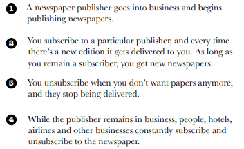

# Observer Pattern

**Given WeatherData class**

### Problem Statement

                 

**A Naive implementation**

### Meet the Observer Pattern

Let’s take a look at how a newspaper/magazine subscription model works:

Anytime the Duck object can ask the Subject to become a subscriber. Once the subject registers the Duck object, it becomes an official observer. Now Duck will also receive a notification that Subject has been updated.

Similarly, mouse object can ask the subject to remove/ unsubscribe him. Now onwards, all of the observers get notification but not the Mouse object.

### The Observer Pattern defined

### Designing the Weather Station

The WeatherData class certainly has state... that’s the temperature, humidity and barometric pressure. And when those measurements change, we have to notify all the display elements so that they perform a desired action. 

**How do we get the weather measurements to the display elements?**

If we make the WeatherData object the subject, and the display elements the observers, then the displays will register themselves with the WeatherData object in order to get the information they want.

Once the Weather Station knows about a display element, then it can just call a method to tell it about the measurements. 

**Note**: Although every display element has a different type, they should all implement same interface so that the WeatherData object will know how to send them the measurements. 

So every display will have, say, an update() method that WeatherData will call. And update() is defined in a common interface that all the elements implement… 

**Implementing the Weather Station**

  

**Implementing the Weather Data**

   

**Building the display elements**

**Q: Why did you store a reference to the Subject? It doesn’t look like you use it again after the constructor?**

**A:** True, but in the future we may want to un-register ourselves as an observer and it would be handy to already have a reference to the subject.

**Now we can add a display to show the heat index.**

### Using Java’s built-in Observer Pattern

- **java.util package provides the Observer interface and the Observable class. All you have to do is extend Observable and tell it when to notify the Observers.**

- **You can implement either a push or pull style of update to your observers.**

**Check out this reworked OO design for the WeatherStation:**

**The built in Observer Pattern works a bit differently than the implementation that we used on the Weather Station.** The most obvious difference is that WeatherData (our subject) now extends the Observable class and inherits the add, delete and notify Observer methods (among a few others). 

**Here’s how we use Java’s in-built version:**

**Why do we need this setChanged() method? We didn’t need that before.**

The setChanged() method is used to signify that the state has changed and should update its observers when notifyObservers() is called. If notifyObservers() is called without calling setChanged(), observers will NOT be notified. 

 **Pseudocode for Observable**

**Why is this necessary?**

The setChanged() method is meant to give you more flexibility in how you update observers by allowing you to optimize the notifications. 

For example, in our weather station, imagine if our measurements were so sensitive that the temperature readings were constantly fluctuating by a few tenths of a degree. That might cause the WeatherData object to send out notifications constantly. Instead, we might want to send out notifications only if the temperature changes more than half a degree and we could call setChanged() only after that happened. 

**If this functionality is useful to you, you may also want to use the**

- **clearChanged() method, which sets the changed state back to false**

- **hasChanged() method, which tells you the current state of the changed flag**

**First, let’s rework WeatherData to use java.util.Observable**

**Now, let’s rework the CurrentConditionsDisplay**

**Hmm, do you notice anything different?**

You’ll see all the same calculations, but the order of the text output is different. It depends on how JAVA java.util.Observable implements its notifyObservers().

Unfortunately, the java.util.Observable implementation has a number of problems that limit its usefulness and reuse. 

**Observable is a class. So what?**

Because Observable is a class, not an interface, you have to subclass it. That means you can’t add Observable behavior to an existing class that already extends another superclass. 

**Thus, java.util.Observable violate our OO design principle of programming to interfaces not implementations**

**Observable protects crucial methods such as the setChanged() method. So what? **This means you can’t call setChanged() unless you’ve subclassed Observable. This means you can’t even create an instance of the Observable class and compose it with your own objects, you have to subclass. 

**Thus, java.util.Observable violate our OO design principle of favoring composition over inheritance.**

