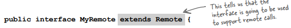
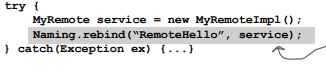
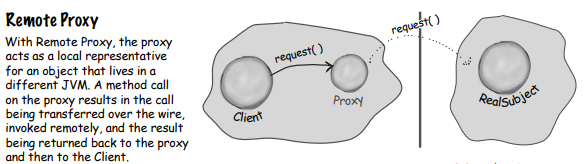

# Proxy Pattern

### Problem Statement: CEO wants a GumballMachine Monitor that creates a report that prints the machine’s location, inventory of gumballs and the current machine state.

**A:** We already have methods in gumball machine for getting gumball count (getCount()), and machine’s current state (getState()).  We need to add a location field.

**Adding support for locations to the GumballMachine**

**Coding the GumballMonitor**

**Testing the Monitor**

**The monitor looks great but we need to monitor gumball machines REMOTELY!**

**Digging Deeper**

We’ve already got the monitor code written, right? We give the GumballMonitor a reference to a machine and it gives us a report. 

The problem is that monitor runs in the same JVM as the gumball machine and the CEO wants to sit at his desk and remotely monitor the machines! 

So what if we left our GumballMonitor class as is, but handed it a proxy to a remote object?

Let’s start at the beginning... a proxy is a stand in for a real object. In this case, the proxy acts just like it is a Gumball Machine object, but behind the scenes it is communicating over the network to talk to the real, remote GumballMachine.

So you’re saying we keep our code as it is, and we give the monitor a reference to a proxy version of the GumballMachine... And this proxy pretends it’s the real object, but it’s really just communicating over the net to the real object.

**The role of the ‘remote proxy’**

A remote proxy acts as a local representative to a remote object. 

What’s a "remote object?" It’s an object that lives in the heap of a different Java Virtual Machine (or more generally, a remote object that is running in a different address space).

What’s a "local representative?" It’s an object that you can call local methods on and have them forwarded on to the remote object.

Your client object (GumballMonitor) acts like it’s making remote method calls. 

But what it’s really doing is calling methods on a ‘proxy’ object in local heap that handles all the low-level details of network communication.

How do we create a proxy that knows how to invoke a method on an object that lives in another JVM? Well, you can’t get a reference to something on another heap, right? 

  
Whatever the variable d is referencing must be in the same heap space as the code running the statement. 

**So how do we approach this?**   
We’ll take advantage of Java’s built in Remote Method Invocation functionality.   
... RMI gives us a way to find objects in a remote JVM and allows us to invoke their methods.

**How Remote Methods work?**  
Let’s say we want to design a system that allows us to call a local object that forwards each request to a remote object. How would we design it?

The client calls a method on the client helper, as if the client helper were the actual service. The client helper then takes care of forwarding that request for us. 

But the client helper isn’t really the remote service. Although the client helper acts like it (because it has the same method that the service is advertising), the client helper doesn’t have any of the actual method logic the client is expecting. 

Instead, the client helper contacts the server, transfers information about the method call (e.g., name of the method, arguments, etc.), and waits for a return from the server. 

On the server side, the service helper receives the request from the client helper (through a Socket connection), unpacks the information about the call, and then invokes the real method on the real service object. So, to the service object, the call is local. 

The service helper gets the return value from the service, packs it up, and ships it back (over a Socket’s output stream) to the client helper. The client helper unpacks the information and returns the value to the client object.

  

  

  

**→ JAVA RMI Detour**

What RMI does? Builds the client helper (with the same methods as the remote service) and service helper objects. You don’t have to write any of the networking or I/O code yourself. 

With your client, you call remote methods (i.e., the ones the Real Service has) just like normal method calls on objects running in the client’s own local JVM. 

But there is one difference between RMI calls and local (normal) method calls.  
*** Even though to the client it looks like the method call is local, the client helper sends the method call across the network. So there is networking and I/O.  
Networking and I/O methods are risky!!! They can fail! And so, they throw exceptions.   
As a result, the client does have to acknowledge the risk.

RMI also provides all the runtime infrastructure to make it all work, including a lookup service that the client can use to find and access the remote objects.

### Looking at the Server Side
Steps needed to transform an ordinary object so that it can accept remote calls (i.e. can be called by a remote client).

We’ll be doing this later to our GumballMachine. 

**1) Make a Remote Interface**  

(e.g., interface for our methods of the GumballMachine!)

 Both the Stub and actual service will implement this!

**2) Make a Remote Implementation**

  

It’s the object that the client wants to call methods on (e.g., our GumballMachine!).

**3) Generate the stubs and skeletons using rmic**  

These are client and server ‘helpers’.   
You don’t have to create these classes.   
It’s all handled automatically when you run the rmic tool that ships with your Java development kit.

**4) Start the RMI registry (rmiregistry)**  

The rmiregistry is like the white pages of a phone book. It’s where the client goes to get the proxy (the client stub/helper object).

**5) Start the remote service**   

You have to get the service object up and running. 

Your service implementation class instantiates an instance of the service and registers it with the RMI registry. Registering it makes the service available for clients.

 

**Step one: make a Remote interface**

Remote is a ‘marker’ interface i.e. it has no methods but has a special meaning for RMI. 

(** Notice that we say ‘extends’ here. One interface is allowed to extend another interface)

The client uses the remote interface type to invoke methods on the stub and since the stub is doing networking and I/O, all kinds of Bad Things can happen. 

The client has to acknowledge the risks by handling or declaring the remote exceptions.  

Any argument to a remote method has to be packaged up and shipped across the network, and that’s done through Serialization. Same thing with return values. 

If you use primitives, Strings, and the majority of types in the API (including arrays and collections), you’ll be fine. 

If you are passing around your own types, just be sure that you make your classes implement Serializable.

 

**Step two: make a Remote implementation**

In order to work as a remote service object, your object needs some functionality related to ‘being remote’.   
The simplest way is to extend UnicastRemoteObject and let that superclass do this work.

When MyRemoteImpl class is instantiated, its superclass constructor is always called. In this case, the constructor of superclass i.e. UnicastRemoteObject throws a RemoteException.  
To deal with this declare that your constructor also throws an exception.

Now that you’ve got a remote service, you have to make it available to remote clients. You do this by instantiating it and putting it into the RMI registry (which must be running or this line of code fails). 

When you register the implementation object, the RMI system actually puts the stub in the registry, since that’s what the client really needs. 

 

**Coding the Remote Interface**

**Coding the Remote service (the implementation):**

 

**Step three: generate stubs and skeletons**

The rmic tool, which comes with the Java software development kit, takes a service implementation and creates two new classes, the stub and the skeleton. It uses a naming convention that is the name of your remote implementation, with either _Stub or _Skel added to the end. 

The classes will land in the current directory (i.e. whatever you did a cd to). Remember, rmic must be able to see your implementation class, so you’ll probably run rmic from the directory where your remote implementation is located. 

 

**Step four: run rmiregistry**

 

**Step four: start the service**

 

### Looking at the Client Side

**How does the client get the stub object?**

The client has to get the stub object (our proxy), since that’s the thing the client will call methods on. 

**How does it work?**

 

**Back to our GumballMachine**

 

**Getting the GumballMachine ready to be a remote service**

1) Create a remote interface for the GumballMachine. This will provide a set of methods that can be called remotely.

**2) Make sure all the return types in the interface are serializable.**  

 

**Each State object maintains a reference to a gumball machine so that it can call the gumball machine’s methods and change its state. We don’t want the entire gumball machine serialized and transferred with the State object.**

 

**3) Implement the interface in a concrete class.**

**Registering gumball machine service with RMI registry so that clients can locate it**

**Run this for each machine**

**NOTE: Here we didn’t use rmic to generate the stub and skeleton. You’ll this at the end of chapter.**

  

**Now for the GumballMonitor client…**  

**Writing the Monitor test drive**

**And now let’s put the monitor in the hands of the CEO.**

 

### What happens under the hood

### The Proxy Pattern defined

Well, we’ve seen how the Proxy Pattern provides a surrogate or placeholder for another object. We’ve also described the proxy as a "representative" for another object. 

**But what about a proxy controlling access?**  
In the case of the gumball machine, just think of the proxy controlling access to the remote object. The proxy needed to control access because our client, the monitor, didn’t know how to talk to a remote object. So in some sense the remote proxy controlled access so that it could handle the network details for us. 

There are many variations of the Proxy Pattern. What they all have in common is that they intercept a method invocation that the client is making on the subject. This level of indirection allows us to "controls access." 

Here are a few ways proxies control access:  
* As we know, a remote proxy controls access to a remote object.   
* A virtual proxy controls access to a resource that is expensive to create.   
* A protection proxy controls access to a resource based on access rights.  

**Class Diagram**

 

**Get ready for Virtual Proxy**

**Let’s check out the Virtual Proxy and compare it to Remote Proxy:**

**Displaying CD covers**

**Problem Statement: Write an application that displays compact disc covers.**

**You might create a menu of the CD titles and then retrieve the images from an online service. This might take a little time, depending on the network connection.**

**So your application should display something while you are waiting for the image to load. We also don’t want to hang up the entire application while it’s waiting on the image. Once the image is loaded, the message should go away and you should see the image.**

**An easy way to achieve this is through a virtual proxy. The virtual proxy can stand in place of the icon, manage the background loading, and before the image is fully retrieved from the network, display "Loading CD cover, please wait...". Once the image is loaded, the proxy delegates the display to the Icon.**

**Designing the CD cover Virtual Proxy**

The class diagram is similar to Remote Proxy, but here the proxy is used to hide an object that is expensive to create (because we need to retrieve the data for the Icon over the network).

**Writing the Image Proxy**

**What we actually do ???**

**Testing the CD Cover Viewer**

  

 

**Behind the Scenes**

 

### Comparing the Proxy With Decorator & Adapter

**Q: ImageProxy seems just like a Decorator. I mean, we are basically wrapping one object with another and then delegating the calls to the ImageIcon. Isn’t it?**  
**A:** Sometimes Proxy and Decorator look similar, but their purposes are different: a decorator adds behavior to a class, while a proxy controls access to it. 

You might say, "Isn’t the loading message adding behavior?" In some ways it is; however, more importantly, the ImageProxy is controlling access to an ImageIcon. 

**How does it control access?** The proxy is decoupling the client from the ImageIcon. If they were coupled the client would have to wait until each image is retrieved before it could paint it entire interface. The proxy **controls access** to the ImageIcon so that before it is fully created, the proxy provides another on screen representation. Once the ImageIcon is created the proxy allows access.

---------------------------------------------------------------------------------------------------------------------------

**Note: Sometimes we informally say a proxy wraps its Subject, that’s not really an accurate term. Why?**

Think about a remote proxy... what object am I wrapping? The object I’m representing and controlling access to lives on another machine!

Take a virtual proxy... think about the CD viewer example. When the client first uses the proxy, the subject doesn’t even exist! So what am I wrapping there? 

That is a big difference:  Decorators only add window dressing; they never get to instantiate anything.

---------------------------------------------------------------------------------------------------------------------------

**Q: I see how Decorator and Proxy relate, but what about Adapter? An adapter seems very similar as well.**  
**A:** Both Proxy and Adapter sit in front of other objects and forward requests to them. Remember that Adapter changes the interface of the objects it adapts, while the Proxy implements the same interface. 

There is one additional similarity that relates to the Protection Proxy. A Protection Proxy may allow or disallow a client access to particular methods in an object based on the role of the client. In this way a Protection Proxy may only provide a partial interface to a client, which is quite similar to some Adapters. 

---------------------------------------------------------------------------------------------------------------------------

**Q: How do I make clients use the Proxy rather than the Real Subject?**  
**A:** One common technique is to provide a factory that instantiates and returns the subject. Because this happens in a factory method we can then wrap the subject with a proxy before returning it. The client never knows or cares that it’s using a proxy instead of the real thing. 

 

### Protection Proxy

**We have a dating/matchmaking service. The service provides a "Hot or Not" feature where participants can rate each other.**

**The service revolves around a Person bean that allows you to set and get information about a person:**

**The PersonBean interface**

**The PersonBean implementation**

**The way our PersonBean is defined, any client can call any of the methods. It has 2 problems:**  
* **You shouldn’t be able to give yourself a rating.**  
* **You shouldn’t be able to change another customer’s data (like their interests)**  

**This is a perfect example of where we might be able to use a Protection Proxy.**

**What’s a Protection Proxy?**  
**It’s a proxy that controls access to an object based on access rights.**  

**For instance, if we had an employee object, a protection proxy might allow the employee to call certain methods on the object, a manager to call additional methods (like setSalary()), and a human resources employee to call any method on the object.**

**In our dating service we want to make sure that a customer can set his own information while preventing others from altering it.**

**Next, we want other customers to be able to set the HotOrNot ratings, but not that particular customer.**

 

**Using the Java API’s Proxy to create a protection proxy**

Java has its own proxy support right in the java.lang.reflect package. With this package, Java lets you create a proxy class at runtime that implements one or more interfaces and forwards method invocations on the proxy class to an invocation Handler. 

We’re going to use Java’s dynamic proxy to create our protection proxy, but before we do that, let’s quickly look at a class diagram:

Because Java creates the Proxy class for you, you need a way to tell the Proxy class what to do. You can’t put that code into the Proxy class like we did before, because you’re not implementing one directly. So, you put this code in an InvocationHandler. 

The job of the InvocationHandler is to respond to any method calls on the proxy. Think of the InvocationHandler as the object the Proxy asks to do all the real work after it’s received the method calls. 

**Big Picture: Creating a Dynamic Proxy for the PersonBean**

We have a couple of problems to fix: customers shouldn’t be changing their own HotOrNot rating and customers shouldn’t be able to change other customers’ personal information. 

To fix these problems we’re going to create two proxies:  
1. For accessing your own PersonBean object    
2. For accessing another customer’s PersonBean object.   
That way, the proxies can control what requests can be made in each circumstance.  

We’re going to use the Java API’s dynamic proxy to create two proxies for us; all we need to do is supply the handlers that know what to do when a method is invoked on the proxy.

**Step 1: Create two InvocationHandlers**  
As you’ll see Java will take care of creating the actual proxy class and object, we just need to supply a handler that knows what to do when a method is called on it. 

InvocationHandlers implement the behavior of the proxy. 

**Step 2: Write the code that creates the dynamic proxies**  
We need to write a little bit of code to generate the proxy class and instantiate it. 

**Step 3: Wrap any PersonBean object with the appropriate proxy**  
When we need to use a PersonBean object, either it’s the object of the customer himself (in that case, will call him the "owner"), or it’s another user of the service that the customer is checking out (in that case we’ll call him “nonowner”). 

In either case, we create the appropriate proxy for the PersonBean.

**Step 1: Creating Invocation Handlers**  
We need to write two invocation handlers, one for the owner and one for the non-owner. 

**But what are invocation handlers?**  
When a method call is made on the proxy, the proxy forwards that call to your invocation handler.

There’s only one method, invoke(), and no matter what methods get called on the proxy, the invoke() method is what gets called on the handler. Let’s see how this works:

 

**When invoke() is called by the proxy, how do you know what to do with the call?**  
Typically, you’ll examine the method that was called on the proxy and make decisions based on the method’s name and possibly its arguments. 

--------------------------------

**Step 2: Dynamically** **creating the Proxy class and instantiating the Proxy object**  
Let’s write a method that takes a PersonBean and creates the proxy that forwards its method calls to the OwnerInvocationHandler. 

Write getNonOwnerProxy(), which returns a proxy for the NonOwnerInvocationHandler:

**Q: So what exactly is the "dynamic" aspect of dynamic proxies?**  
**A:** The proxy is dynamic because its class is created at runtime.  
Think about it: before your code runs there is no proxy class; it is created on demand from the set of interfaces you pass it.

**Q: Is there any way to tell if a class is a Proxy class?**  
**A:** Yes. The Proxy class has a static method called isProxyClass(). Calling this method with a class will return true if the class is a dynamic proxy class. Other than that, the proxy class will act like any other class that implements a particular set of interfaces.

**Q: Are there any restrictions on the types of interfaces I can pass into newProxyInstance()?**    
**A:** Yes, there are a few minor nuances in javadocs, but here are a few major ones:   
* We always need to pass newProxyInstance() an array of interfaces – only interfaces are allowed, no classes.   
* All non-public interfaces need to be from the same package.  
* You also can’t have interfaces with clashing method signature.   

 

**Testing the matchmaking service**

**Why aren’t we using rmic…...Arriving at an answer**

**We got rid of skeletons back in Java 1.2.**  
We don’t need to actually generate skeletons. As of Java 1.2, the RMI runtime can dispatch the client calls directly to the remote service using reflection. 

But we like to show the skeleton, because conceptually it helps you to understand that there is something under the covers that’s making that communication between the client stub and the remote service happen. 

**In Java 5, no need to generate stubs anymore either.**  
In Java 5, RMI and Dynamic Proxy got together and now stubs are generated dynamically using Dynamic Proxy. The remote object’s stub is a java.lang.reflect.Proxy instance (with an invocation handler) that is automatically generated to handle all the details of getting the local method calls by the client to the remote object. 

So, now you don’t have to use rmic at all; everything you need to get a client talking to a remote object is handled for you behind the scenes. .

 

### The Proxy Zoo

Some more variations of this pattern in the real world.

**Firewall Proxy** controls access to a set of network resources, protecting the subject from "bad" clients.

Habitat: often seen in the location of corporate firewall systems.

**Caching Proxy** provides temporary storage for results of operations that are expensive. It can also allow multiple clients to share the results to reduce computation or network latency.

Habitat: often seen in web server proxies as well as content management and publishing systems.

**Synchronization Proxy** provides safe access to a subject from multiple threads.

Habitat: Seen hanging around JavaSpaces, where it controls synchronized access to an underlying set of objects in a distributed environment

**Copy-On-Write Proxy** controls the copying of an object by deferring the copying of an object until it is required by a client. This is a variant of the Virtual Proxy.

Habitat: seen in the vicinity of the Java 5’s CopyOnWriteArrayList.

**Smart Reference Proxy** provides additional actions whenever a subject is referenced, such as counting the number of references to an object.

**Complexity Hiding Proxy** hides the complexity of and controls access to a complex set of classes. This is sometimes called the Facade Proxy for obvious reasons. The Complexity Hiding Proxy differs from the Facade Pattern in that the proxy controls access, while the Facade Pattern just provides an alternative interface.

