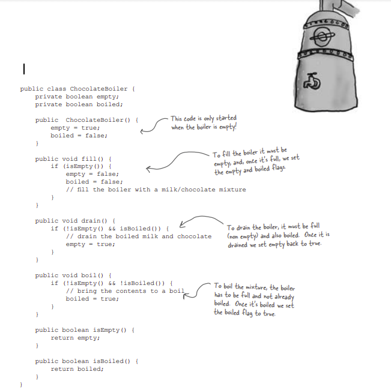

# Singleton Pattern

Let’s say you have an object that contains registry settings. You don’t want multiple copies of that object and its values running around – that would lead to all sorts of problems like incorrect program behavior, overuse of resources, or inconsistent results.

Singleton assures that every object in an application makes use of the same global resource.

There are many objects we only need one of: connection or thread pools, caches, dialog boxes, objects that handle preferences, objects used for logging, and objects that act as device drivers to devices like printers and graphics cards. 

### Implementing a Singleton Class

  

### Singleton Pattern defined


**The Chocolate Factory**

All modern chocolate factories have computer controlled chocolate boilers. The job of the boiler is to take in chocolate and milk, bring them to a boil, and then pass them on to the next phase of making chocolate bars. 

Here’s the controller class for Choc-O-Holic, Inc.’s industrial strength Chocolate Boiler. Check out the code; you’ll notice they’ve tried to be very careful to ensure that bad things don’t happen, like draining 500 gallons of unboiled mixture, or filling the boiler when it’s already full, or boiling an empty boiler!




**Houston, we have a problem...**

Despite the fact that we used the Classic Singleton, somehow the ChocolateBoiler’s fill() method was able to start filling the boiler even though a batch of milk and chocolate was already boiling! 

That’s 500 gallons of spilled milk (and chocolate)! 

**What happened!?**  
**Could the addition of threads have caused this?**


### Dealing with multithreading

**Our multithreading woes are almost trivially fixed by making getInstance() a synchronized method:**


**But synchronization is expensive; is this an issue?**

It’s actually a little worse: the only time synchronization is relevant is the first time through this method. In other words, once we’ve set the uniqueInstance variable to an instance of Singleton, we have no further need to synchronize this method. After the first time through, synchronization is totally unneeded overhead!

**Synchronizing a method can decrease performance by a factor of 100, so if a high traffic part of your code begins using getInstance(), you may have to reconsider.**

**Few Options to improve**

1. **Move to an eagerly created instance rather than a lazily created one**

If your application always creates and uses an instance of the Singleton or the overhead of creation and runtime aspects of the Singleton are not onerous, you may want to create your Singleton eagerly, like this:


Using this approach, we rely on the JVM to create the unique instance of the Singleton when the class is loaded. The JVM guarantees that the instance will be created before any thread accesses the static uniqueInstance variable. 

**2) Use "double-checked locking"**

With double-checked locking, we first check to see if an instance is created, and if not, THEN we synchronize. This way, we only synchronize the first time through, just what we want.


**Q: Isn’t a Singleton class violating the "One Class, One Responsibility" principle**

**A:** Yes, Singleton is not only responsible for managing its one instance (and providing global access), it is also responsible for whatever its main role is in your application. So, certainly it can be argued it is taking on two responsibilities. Nevertheless, it isn’t hard to see that there is utility in a class managing its own instance; it certainly makes the overall design simpler. 

**Q: Is it okay to subclass a Singleton?**

**A:** One problem with subclassing Singleton is that the constructor is private. You can’t extend a class with a private constructor. So, the first thing you’ll have to do is change your constructor so that it’s public or protected. But then, it’s not really a Singleton anymore, because other classes can instantiate it.

If you do change your constructor, there’s another issue. The implementation of Singleton is based on a static variable, so if you do a straightforward subclass, all of your derived classes will share the same instance variable. This is probably not what you had in mind. 

Before implementing such a scheme, you should ask yourself what you are really gaining from subclassing a Singleton. Like most patterns, the Singleton is not necessarily meant to be a solution that can fit into a library.

**Q: Can’t I just create a class in which all methods and variables are defined as static? Wouldn’t that be the same as a Singleton?**

**A:** Yes, if your class is self-contained and doesn’t depend on complex initialization. However, because of the way static initializations are handled in Java, this can get very messy, especially if multiple classes are involved. Often this scenario can result in subtle, hard to find bugs involving order of initialization. Unless there is a compelling need to implement your "singleton" this way, it is far better to stay in the object world.

**Q: I still don’t totally understand why global variables are worse than a Singleton.**

**A:** In Java, global variables are basically static references to objects. There are a couple of disadvantages to using global variables in this manner. We’ve already mentioned one: the issue of lazy versus eager instantiation. But we need to keep in mind the intent of the pattern: to ensure only one instance of a class exists and to provide global access. A global variable can provide the latter, but not the former. Global variables also tend to encourage developers to pollute the namespace with lots of global references to small objects. Singletons don’t encourage this in the same way, but can be abused nonetheless.

**Q: What about class loaders? I heard there is a chance that two class loaders could each end up with their own instance of Singleton.**

**A:** Yes, that is true as each class loader defines a namespace. If you have two or more classloaders, you can load the same class multiple times (once in each classloader). Now, if that class happens to be a Singleton, then since we have more than one version of the class, we also have more than one instance of the Singleton. So, if you are using multiple classloaders and Singletons, be careful. One way around this problem is to specify the classloader yourself.

### Breaking a Singleton

**1) Using Reflections**

```java
import java.lang.reflect.Constructor;

public class ReflectionSingletonTest {

    public static void main(String[] args) {
        Singleton instanceOne = Singleton.getInstance();
        Singleton instanceTwo = null;

        try {
            Constructor[] constructors = 
                                Singleton.class.getDeclaredConstructors();

            for (Constructor constructor : constructors) {
                //Below code will destroy the singleton pattern
                constructor.setAccessible(true);
                instanceTwo = (Singleton) constructor.newInstance();
                break;
            }
        } catch (Exception e) {
            e.printStackTrace();
        }
        System.out.println(instanceOne);
        System.out.println(instanceTwo);
    }
}

Output:
com.Singleton@544a5ab2
com.Singleton@5d888759
```


**Remedy**

Check the static instance to be not null and throw Error if it is not null which means one instance already exists as.

```java
private Singleton () {
	if(instance != null){
		throw new InstantiationError("Already there");
	}
}
```
<br>
**2) Serialization and Deserialization**

De-serialization always creates a new instance. 

```java
public class SerializationTest {
 
    public static void main(String[] args) {
        try {
            Singleton instanceOne = Singleton.getInstance();
            
            // Serialize to a file
            String f = "filename.ser";
            ObjectOutput out = new ObjectOutputStream(new FileOutputStream(f));
            out.writeObject(instanceOne);
            out.close();
 
            // Serialize to a file
            ObjectInput in = new ObjectInputStream(new FileInputStream(f));
            Singleton instanceTwo = (Singleton) in.readObject();
            in.close();
 
            System.out.println(instanceOne);
            System.out.println(instanceTwo);
 
        } catch (Exception e) {
            e.printStackTrace();
        }
    }
}
 
Output:
com.Singleton@544a5ab2
com.Singleton@5d888759
```


**Remedy**

Override readResolve() method in the Singleton class that extends Serializable. 

This method will be invoked when you de-serialize the object. Inside of this method, you must return the existing instance to ensure a single instance application wide.

```java
protected Object readResolve() {
       return instance;
}
```

<br>
**3) Break by Cloning**

If a Singleton class implements java.lang.Cloneable interface then invoking clone() method on its single instance creates a duplicate object. Consider the below code:

```java
public class Singleton implements Cloneable{
 
	private static Singleton instance = new Singleton();
 
	private static Singleton getInstance(){
		return instance;
	}
 
	public static void main(String[] args) 
                      throws CloneNotSupportedException {
		Singleton obj = Singleton.getInstance();
		System.out.println(obj);
		System.out.println(obj.clone());
	}	
}

Output:
com.Singleton@544a5ab2
com.Singleton@5d888759
```


**Remedy**

Don’t make the class which should be Singleton implement java.lang.Cloneable. If it extends a class which implements Cloneable, then override clone method and throw CloneNotSupportedException from it. This will prevent clone creation.

<br>

**Making Singletons With Enum in Java**

All of the above problems can be solved very easily by using the enum type to make singletons.

```java
public enum EnumSingleton {
    INSTANCE;
    
    public void doSomething(){
        //do something
    }
}
```


To access the singleton object: MySingleton.INSTANCE

To access the singleton's methods: MySingleton.INSTANCE.doSomething();

Together, the following 4 things ensure that no instances of an enum type exist beyond those defined by the enum constants.

* An **enum** type has **no** instances other than those defined by its **enum** constants. 

It is a compile-time error to attempt to explicitly instantiate an enum type. Java ensures that any enum value is instantiated only once in a Java program. 

* The final clone method in Enum ensures that enum constants can never be cloned.

* The special treatment by the serialization mechanism ensures that duplicate instances are never created as a result of deserialization. 

* Reflective instantiation of enum types is prohibited. 

**The drawback is that the enum type is somewhat inflexible; for example, it does not allow lazy initialization.**

