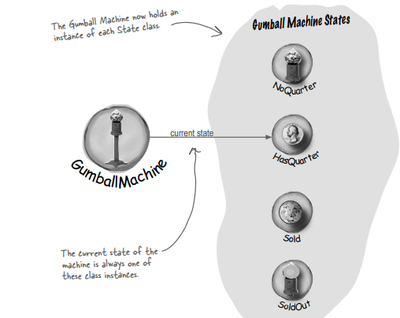

# State Pattern

### Problem Statement

Here’s the way a gumball machine needs to work. 

This is a state diagram. Each of those circles represents a state and each of the arrows is a state transition.

All states are just different configurations of the machine that behave in a certain way and need some action to take them to another state.

For ex: if the gumball machine is in the "No Quarter" state and you put a quarter in, it will change to the “Has Quarter” state. That’s the state transition.

 And if the machine is in the "Has Quarter" state, I can turn the crank and change to the “Gumball Sold” state, or eject the quarter and change back to the “No Quarter” state.

But... when we dispense, we test for zero or more gumballs in the "Gumball Sold" state, and then either go to the “Out of Gumballs” state or the “No Quarter” state. 

So we actually have five transitions from one state to another and in total four states.

*** Also, don’t forget that user could do nonsensical things, like trying to eject the quarter when the gumball machine is in the "No Quarter" state, or insert two quarters.

### From state diagram to actual code

**In-house testing**

**You knew it was coming... a change request!**

10% of the time, when the crank is turned, the customer gets two gumballs instead of one.

**Revised State Diagram**

**Code Modifications Required**

**Based on our first implementation, which of the following apply?**

We first need to refactor this code so that it’s easy to maintain and modify.

**Follow "encapsulate what varies" principle**  
Localize the behavior for each state (i.e. put each state’s behavior in its own class) so that if we make changes to one state, we don’t run the risk of messing up the other code. 

**Favor composition**  
Let the Gumball Machine just delegate to the state object that represents the current state. 

**Will this make it easier to add new states?**  
Changes will be limited because adding a new state will mean we just have to add a new class and maybe change a few transitions here and there. 

**Finalising the New design**  
Encapsulate state objects in their own classes and then delegate to the current state when an action occurs. 

**First let’s create an interface for State, which all our states implement:**

**Lets first specify the behavior of the state classes when each action is called.**

### Implementing our State classes

### Reworking the Gumball Machine

**Implementing more states**

**Let’s take a look at what we’ve done so far…**

* Localized the behavior of each state into its own class. 

* Removed all the troublesome if statements that would have been difficult to maintain. 

* Closed each state for modification, and yet left the Gumball Machine open to extension by adding new state classes. 

* Created a code base and class structure that is easier to read and understand.

### The State Pattern defined

**The first part of this description**  
Because the pattern encapsulates state into separate classes and delegates to the object representing the current state, we know that behavior changes along with the internal state.   
Ex: when the gumball machine is in   
NoQuarterState -------insert a quarter--------> machine accepts the quarter  
HasQuarterState -------insert a quarter--------> machine rejects the quarter 

**The second part of the definition**  
What does it mean for an object to "appear to change its class?" Think about it from the client’s perspective: if an object you’re using can completely change its behavior, then it appears to you that the object is actually instantiated from another class. 

In reality, however, you know that we are using composition to give the appearance of a class change by simply referencing different state objects.

* **The Context gets its behavior by delegating to the current state object it is composed with.**  
* **By encapsulating each state into a class, we localize any changes that will need to be made.**

### Comparing Strategy & State

The class diagrams of the two patterns are similar, but they differ in their intent. 

---------------------------------------------------------------------------------------------------------------------------

The use of composition and delegation is totally different in the two patterns.

**State Pattern** encapsulate state-based behavior and delegate behavior to the current state.

**Strategy Pattern** encapsulate interchangeable behaviors and use delegation to decide which behavior to use.

---------------------------------------------------------------------------------------------------------------------------

**State Pattern allows a Context to change its behavior as state of the Context changes.**  
The Context object is initialised with a state, but then the current state changes across the set of state objects over time according to some well defined state transitions. So the context’s behavior changes over time as well. 

**Strategy Pattern typically configures Context classes with a behavior or algorithm.**  
The context is composed with objects. The client usually specifies the strategy the objects will be using. 

For Ex:  Mallard Duck & Rubber ducks (these are contexts) are composed with objects like flyingBehaviour.  
Mallard Duck was configured with a flyingBehavior as FlyWithWings (i.e. a strategy)  
Rubber Duck was configured with a flying behavior as NoFly (i.e. a strategy)

*** Now, while the pattern provides the flexibility to change the strategy object at runtime, often there is a single strategy object that is most appropriate for a context object. 

---------------------------------------------------------------------------------------------------------------------------

**Think of State Pattern as an alternative to putting lots of conditionals in your context;** By encapsulating the behaviors within state objects, you can simply change the state object in context to change its behavior. 

**Think of the Strategy Pattern as a flexible alternative to subclassing;** 

If you use inheritance to define the behavior of a class, then you’re stuck with that behavior even if you need to change it. With Strategy you can change the behavior by composing with a different object. 

---------------------------------------------------------------------------------------------------------------------------

**Q: Do clients ever interact directly with the states?**  
**A:** No. The states are used by the Context to represent its internal state and behavior, so all requests to the states comes from the Context. You don’t usually want a client changing the state of a Context without that Context’s knowledge.

**Q: If I have lots of instances of the Context in my application, is it possible to share the state objects across them?**  
**A:** Yes, and it is a very common scenario. The only requirement is that your state objects do not keep their own internal state; otherwise, you’d need a unique instance per context. 

To share your states, you’ll typically assign each state to a static instance variable. If your state needs to make use of methods or instance variables in your Context, you’ll also have to give it a reference to the Context in each handler() method.

**Q: In the GumballMachine, the states decide what the next state should be. Do the ConcreteStates always decide what state to go to next?**  
**A:** No, not always. 

State transitions can be controlled by the State classes or by the Context classes. 

As a general guideline, when the state transitions are fixed they are appropriate for putting in the Context; however, when the transitions are more dynamic, they are typically placed in the state classes themselves (for instance, in the GumballMachine the choice of the transition to NoQuarter or SoldOut depended on the runtime count of gumballs). 

Notice that by making this decision, you are making a decision as to which classes are closed for modification – the Context or the state classes – as the system evolves.

**Q: Will the State Pattern typically result in greater number of classes in your design ?**  
**A:** Yes, by encapsulating state behavior into separate state classes, you’ll always end up with more classes in your design. That’s the price you pay for flexibility. 

Consider the alternative of deciding not to use separate objects, you’ll end up with large, monolithic conditional statements. This makes your code hard to maintain and understand. 

**Note:** often what is important is the number of classes that you expose to your clients, and there are ways to hide these extra classes from your clients (say, by declaring them package visible). 

 

**We still need to finish the Gumball 1 in 10 game**

**First, we need to add a state to the GumballMachine class:**

**Implement the WinnerState class**

**Implement the random chance game and add a transition to the WinnerState**

**Demo for the CEO of Mighty Gumball, Inc.**

**Q: Why do we need the WinnerState? Couldn’t we just have the SoldState dispense two gumballs?**  
**A:** SoldState and WinnerState are almost identical, except that WinnerState dispenses two gumballs instead of one. You certainly could put the code to dispense two gumballs into the SoldState. 

The downside is, of course, that now you’ve got TWO states represented in one State class: the state in which you’re a winner, and the state in which you’re not. So you are sacrificing clarity in your State class to reduce code duplication. 

By putting the WinnerState responsibility into the SoldState, you’ve just given the SoldState TWO responsibilities and violated One class, One responsibility principle. What happens when the promotion ends? Or the stakes of the contest change? So, it’s a tradeoff and comes down to a design decision. 

### Refilling the Gumball machine  
Write the refill() method for the Gumball machine. It takes the number of gumballs you’re adding as one argument, and should update the gumball machine count and reset the machine’s state.

