# Strategy Pattern

### SimUDuck app (Duck pond simulation game)

**Problem Statement**

<ul>
	<li><b>Varieties of Ducks</b>
		<ul>
			<li>Mallard Duck</li>
			<li>RedHead Duck</li>
			<li>Rubber Duck</li>
		</ul>
	</li>
	<li><b>Duck Behaviours</b>
		<ul>
			<li>All ducks can swim</li>
			<li>Mallard and redhead can quack</li>
			<li>Rubber duck can squeak</li>
			<li>All have a display name</li>
		</ul>
	</li>
</ul>

**A Possible Implementation**

**New Requirement: Now we need the ducks to FLY**

We can add a fly() method in the Duck class and then all the ducks will inherit it. 

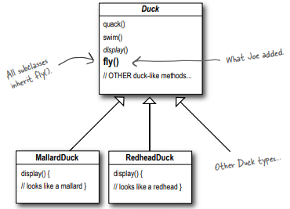

**But something went horribly wrong…**
                                                                                                                                                                                          

**He now has flying Rubber ducks (inanimate objects) in the SimUDuck program. **

**A localized update to the code caused a nonlocal side effect (flying rubber ducks)!**

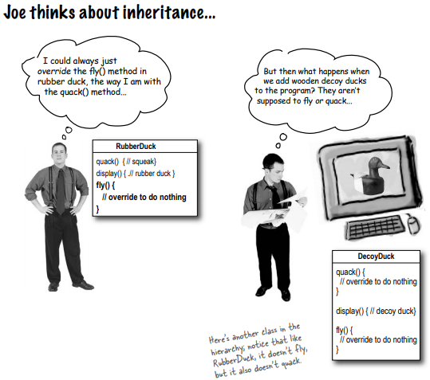

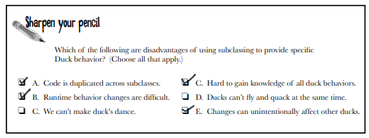

**Runtime behaviour changes are difficult but when are runtime changes required?**

For instance, in this game, if a duck can’t fly initially, but after the score reaches some threshold we need to give it flying capability.

**How about using an Interface?**

So, we need a cleaner way to have only some (but not all) of the duck types fly or quack.

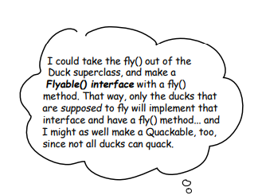

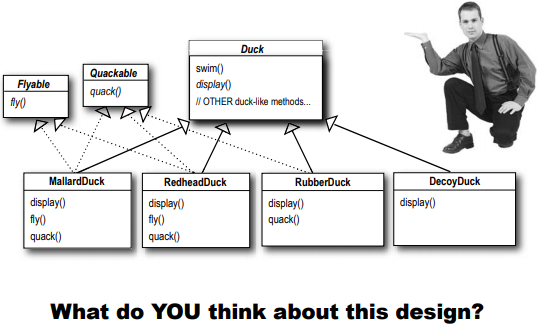

**What do think about the design?**

But while having the subclasses implement Flyable and/or Quackable solves part of the problem (no inappropriately flying rubber ducks), it completely destroys code reuse for those behaviors, so it just creates a different maintenance nightmare. 

**If you thought having to override a few methods was bad, how are you gonna feel when you need to make a little change to the flying behavior... in all 48 of the flying Duck subclasses?!**

**Summarizing the problem**

So we know using inheritance hasn’t worked out very well, since the duck behavior keeps changing across the subclasses, and it’s not appropriate for all subclasses to have those behaviors. 

The Flyable and Quackable interface sounded promising at first—only ducks that really do fly will be Flyable, etc.—except Java interfaces have no implementation code, so no code reuse. And that means that whenever you need to modify a behavior, you’re forced to track down and change it in all the different subclasses where that behavior is defined, probably introducing new bugs along the way!

**Luckily, there’s a design principle for just this situation.**

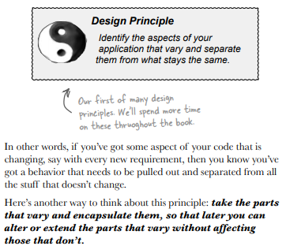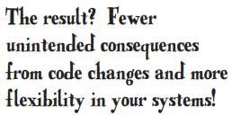

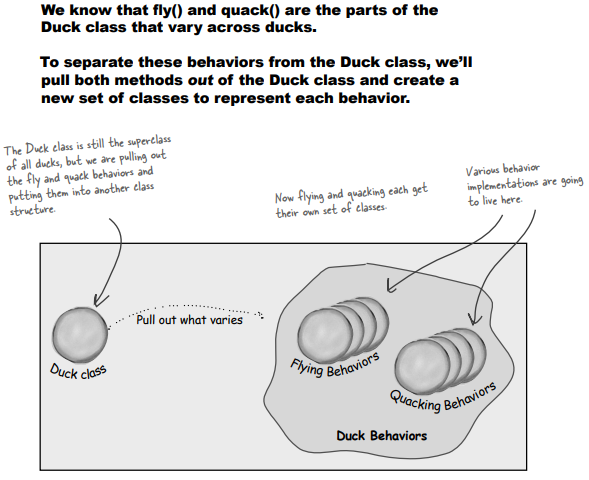

**Implementing Duck Behaviours**

**We’ll use an interface to represent each behavior – for instance, FlyBehavior and QuackBehavior – and each concrete behavior will implement one of those interfaces.**

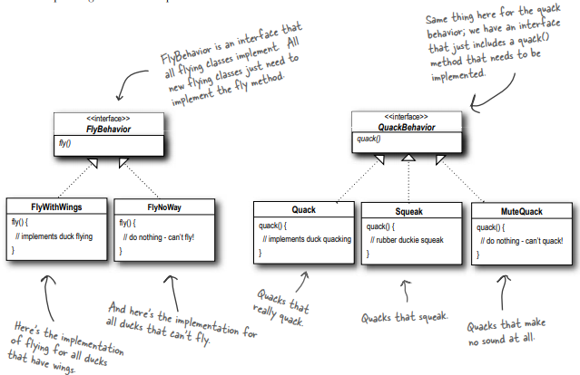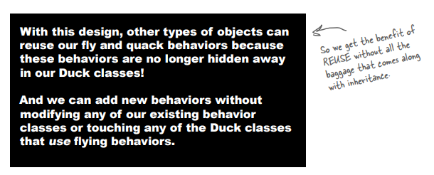

**Designing the Duck Behaviors**

So this time it won’t be the Duck classes that will implement the flying and quacking interfaces. Instead, we have made a set of classes whose entire reason for living is to represent a behavior (for example, "squeaking", “flyWithWings”, “FlyNoWay).

Thus it’s the behavior class, that will implement the behavior interface (ie. flying and quacking interfaces), rather than the Duck class.

**That way, the Duck classes won’t need to know any of the implementation details for their own behaviors.**

**Old Design:** A behavior either came from a concrete implementation in the superclass Duck, or by providing a specialized implementation in the subclass itself. 

In both cases we were relying on an implementation. We were locked into using that specific implementation and there was no room for changing out the behavior (other than writing more code). 

Also, while creating a new Duck subclass we could not reuse the behaviour, we had to override the method again.

**New Design:** Duck superclass will specify the behaviour interface that needs to be used i.e (FlyBehavior and QuackBehavior). 

Duck subclasses should include behavior setter methods to use a behavior  (for example, "flyWithWings", “FlyNoWay) represented by an interface, so that the actual implementation of the behavior (in other words, the specific concrete behavior coded in the class that implements the FlyBehavior or QuackBehavior) won’t be locked into the Duck subclass.

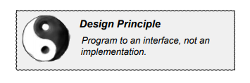

The point is to exploit polymorphism by programming to a supertype so that the actual runtime object isn’t locked into the code. And we could rephrase "program to a supertype" as “the declared type of the variables should be a supertype, usually an abstract class or interface, so that the objects assigned to those variables can be of any concrete implementation of the supertype, which means the class declaring them doesn’t have to know about the actual object types!”

**Integrating Duck Behaviour**

**The key is that a Duck will now delegate its flying and quacking behavior, instead of using quacking and flying methods defined in the Duck class (or subclass).**

1) Add two instance variables to the Duck class called flyBehavior and quackBehavior, that are declared as the interface type (not a concrete class implementation type). 

Remove fly() and quack() methods from the Duck class (and any subclasses) because we’ve moved this behavior out into the FlyBehavior and QuackBehavior classes. 

Replace fly() and quack() in the Duck class with methods, called performFly() and performQuack().

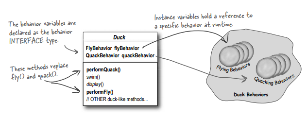

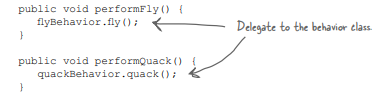

Rather than handling the quack behavior itself, the Duck object delegates that behavior to the object referenced by quackBehavior.

2) Setting the flyBehavior and quackBehavior instance variables. Ex: MallardDuck class: 

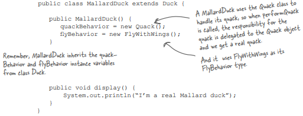

**Wait a second, didn’t you say we should NOT program to an implementation? But what are we doing in that constructor? We’re making a new instance of a concrete Quack implementation class!**

**We’ll see how to dynamically set behaviour**

**Testing the Duck code**

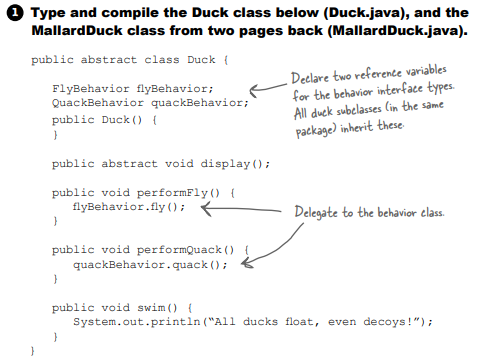

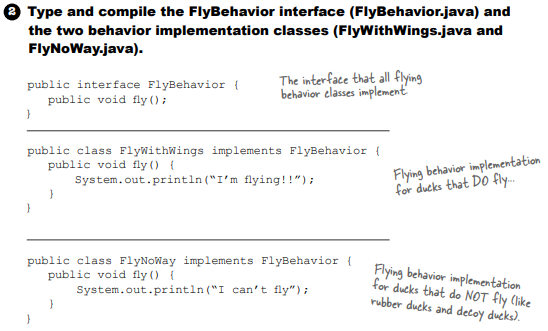

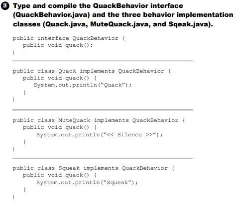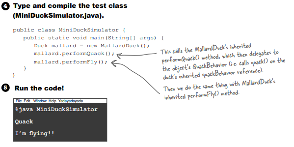

**Dynamically changing duck behavior**

We’re making a new instance of a concrete implementation class in the constructor!

Now we’ll allow each duck object to set these variables polymorphically to reference the specific behavior type it would like at runtime (FlyWithWings, Squeak, etc.). 

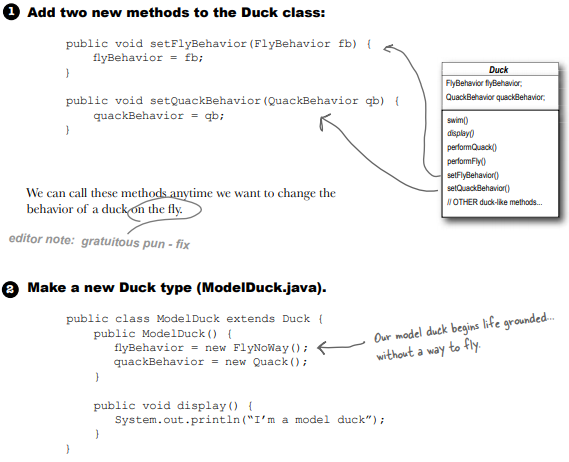

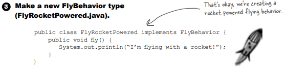

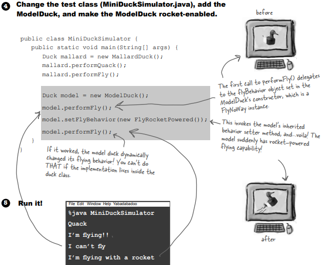

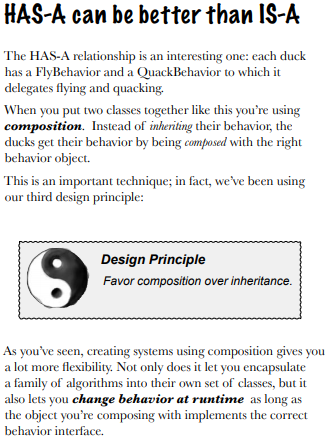

The HAS-A relationship is an interesting one: each duck has a FlyBehavior and a QuackBehavior to which it delegates flying and quacking. 

When you put two classes together like this you’re using **composition**. Instead of inheriting their behavior, the ducks get their behavior by being composed with the right behavior object. 

This is an important technique; in fact, our third design principle:

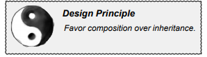

As you’ve seen, creating systems using composition gives you a lot more flexibility. Not only does it let you encapsulate a family of algorithms into their own set of classes, but it also lets you **change behavior at runtime** as long as the object you’re composing with implements the correct behavior interface. 

**Time to define our Strategy Pattern**

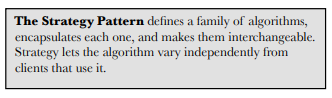

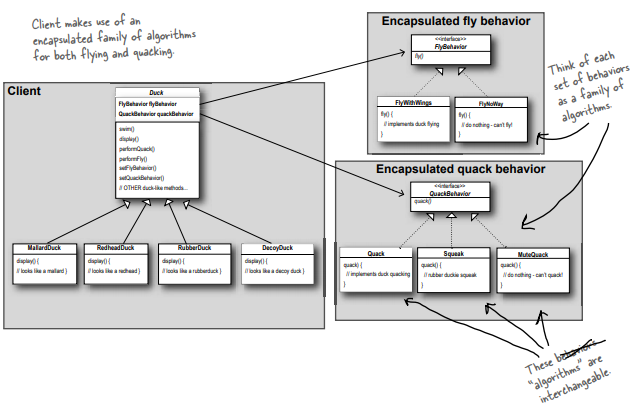

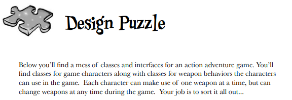

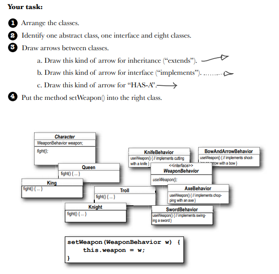

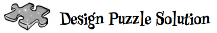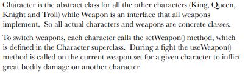

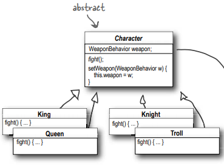

