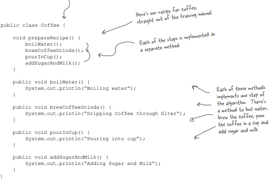

# Template Method Pattern

### Problem Statement:

Writing classes to prepare coffee and tea, given their recipes used by StarBuzz Coffee Shop.

**Preparing Coffee in JAVA**

**Preparing Tea in JAVA**

**Redesigning: Removing Redundancies**

 

**Taking the design further...**

So, can we find a way to abstract prepareRecipe() too? Yes, let’s find out…

Let’s think through this: steeping and brewing aren’t so different; they’re pretty analogous. So let’s make a new method name, say, brew(), and we’ll use the same name whether we’re brewing coffee or steeping tea. 

Likewise, adding sugar and milk is pretty much the same as adding a lemon: both are adding condiments to the beverage. Let’s also make up a new method name, addCondiments(), to handle this. So, our new prepareRecipe() method will look like this:

 

**What have we done?**

 

**Meet the Template Method**

**The Template Method defines the steps of an algorithm and allows subclasses to provide the implementation for one or more steps.**

The CaffeineBeverage class maximizes reuse among the subclasses.

The algorithm lives in one place and code changes only need to be made there.

The Template Method version provides a framework that other caffeine beverages can be plugged into. New caffeine beverages only need to implement a couple of methods.

The CaffeineBeverage class concentrates knowledge about the algorithm and relies on subclasses to provide complete implementations.

  

**Let’s make some tea…**

### Template Method Pattern defined

What’s a template? It’s a method that defines an algorithm as a set of steps. One or more of these steps is defined to be abstract and implemented by a subclass. This ensures the algorithm’s structure stays unchanged, while subclasses provide some part of the implementation.

**Class Diagram**

**Let’s take a closer look at how the AbstractClass is defined**

**Now a look even closer at the types of method that can go in the abstract class:**

**Hooked on Template Method…**  
**A hook is a method that is declared in the abstract class, but only given an empty or default implementation.**  
**This gives subclasses the ability to "hook into" the algorithm at various points, if they wish; a subclass is also free to ignore the hook.**

**Using the hook**

**Let’s go on a Test Drive**

**Q: When I’m creating a template method, how do I know when to use abstract methods and when to use hooks?**  
**A:** Use abstract methods when your subclass MUST provide an implementation of the method or step in the algorithm. 

Use hooks when that part of the algorithm is optional. With hooks, a subclass may choose to implement that hook, but it doesn’t have to. 

Another use is to give the subclass a chance to react to some step in the template method that is about to happen, or just happened. As you’ve seen a hook can also provide a subclass with the ability to make a decision for the abstract class. 

**Q: Does a subclass have to implement all the abstract methods in the AbstractClass?**  
**A:** Yes, each concrete subclass defines the entire set of abstract methods and provides a complete implementation of the undefined steps of the template method’s algorithm. 

 

**The Hollywood Principle**

The Hollywood principle gives us a way to prevent "dependency rot." 

Dependency rot happens when you have high-level components depending on low-level components depending on high-level components depending on sideways components depending on low-level components, and so on. 

When rot sets in, no one can easily understand the way a system is designed. 

With the Hollywood Principle, we allow low-level components to hook themselves into a system, but the high-level components determine when they are needed, and how. 

When we design with the Template Method Pattern, we’re telling subclasses, "don’t call us, we’ll call you." How? Let’s take another look at our CaffeineBeverage design: 	

**Q: What other patterns make use of the Hollywood Principle?**  
**A:** The Factory Method, Observer; any others?

**Q: How does the Hollywood Principle relate to the Dependency Inversion Principle that we learned a few chapters back?**  
**A:** The Dependency Inversion Principle teaches us to avoid the use of concrete classes and instead work as much as possible with abstractions. The Hollywood Principle is a technique for building frameworks or components so that lower-level components can be hooked into the computation, but without creating dependencies between the lower-level components and the higher-level layers. 

So, they both have the goal of decoupling, but the Dependency Inversion Principle makes a much stronger and general statement about how to avoid dependencies in design. The Hollywood Principle gives us a technique for creating designs that allow low-level structures to interoperate while preventing other classes from becoming too dependent on them. 

**Q: Is a low-level component disallowed from calling a method in a higher-level component?**  
**A:** Not really. In fact, a low level component will often end up calling a method defined above it in the inheritance hierarchy purely through inheritance. But we want to avoid creating explicit circular dependencies between the low-level component and the high-level ones.

 

**Template Methods in the Wild**  
This pattern is a great design tool for creating frameworks, where the framework controls how something gets done, but leaves you (the person using the framework) to specify your own details about what is actually happening at each step of the framework’s algorithm.

**We’ve got some ducks to sort…**

compareTo() compares two objects and returns whether one is less than, greater than, or equal to the other. sort() uses this as the basis of its comparison of objects in the array

**Here’s the test drive for sorting Ducks…**

 

**Q: Is this really the Template Method Pattern, or are you trying too hard?**  
**A:** The pattern calls for implementing an algorithm and letting subclasses supply the implementation of the steps – and the Arrays sort is clearly not doing that! But, as we know, patterns in the wild have to be modified to fit the context and implementation constraints and aren’t always just like the textbook patterns.

The designers of the Arrays sort() method had a few constraints. In general, you can’t subclass a Java array and they wanted the sort to be used on all arrays (and each array is a different class). So they defined a static method and deferred the comparison part of the algorithm to the items being sorted. So, while it’s not a textbook template method, this implementation is still in the spirit of the Template Method Pattern. Also, by eliminating the requirement that you have to subclass Arrays to use this algorithm, they’ve made sorting in some ways more flexible and useful. 

**Q: This implementation of sorting actually seems more like the Strategy Pattern than the Template Method Pattern. Why do we consider it Template Method?**  
**A:** You’re probably thinking that because the Strategy Pattern uses object composition. You’re right in a way – we’re using the Arrays object to sort our array, so that’s similar to Strategy. But remember, in Strategy, the class that you compose with implements the entire algorithm. The algorithm that Arrays implements for sort is incomplete; it needs a class to fill in the missing compareTo() method. So, in that way, it’s more like Template Method. 

**Q: Are there other examples of template methods in the Java API?**  
**A:** Yes, you’ll find them in a few places. For example, java.io has a read() method in InputStream that subclasses must implement and is used by the tempate method read(byte b[], int off, int len). 

### Comparing Strategy & Template
The Strategy and Template Method Patterns both encapsulate algorithms, one by inheritance and one by composition.

**Strategy**  
Defines a family of algorithms and make them interchangeable. Since each algorithm is encapsulated, the client can use different algorithms easily.

**Template**  
Defines the outline of an algorithm, but let subclasses do some of the work. That way, I can have different implementations of an algorithm’s individual steps, but keep control over the algorithm’s structure. 

---------------------------------------------------------------------------------------------------------------------------

**Strategy**  
Offers clients a choice of algorithm implementation through object composition instead of using inheritance.

**Template**  
More control over the algorithm and no duplicate code. In fact, if every part of my algorithm is the same except for, say, one line, then my classes are much more efficient than yours. All duplicated code gets into the superclass, so all the subclasses can share it.

**Strategy**  
You might be a little more efficient and require fewer objects. And you might also be a little less complicated in comparison to my delegation model, but I’m more flexible because I use object composition. With me, clients can change their algorithms at runtime simply by using a different strategy object. 

---------------------------------------------------------------------------------------------------------------------------

**NOTE:** The Factory Method is a specialization of Template Method.

